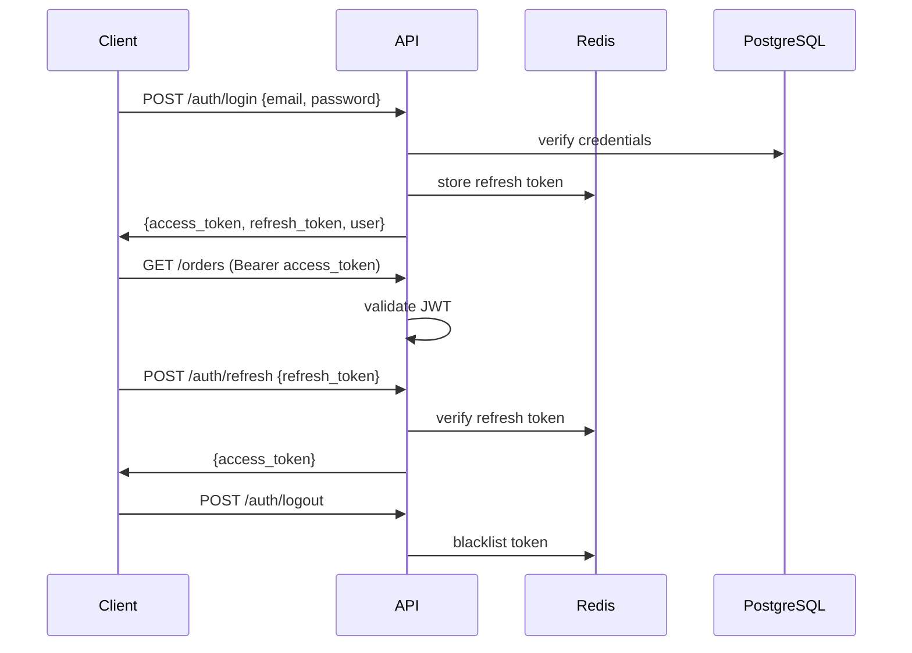

# تصميم REST API

> جزء من [وثيقة التصميم المعماري](./ARCHITECTURE.md)

---

## 1. المبادئ العامة

| المبدأ | التطبيق |
|--------|---------|
| **Style** | RESTful, JSON |
| **Base URL** | `https://server.local/api/v1` |
| **Auth** | Bearer JWT في header `Authorization` |
| **Locale** | `Accept-Language: ar` |
| **Pagination** | `?page=1&limit=20` |
| **Sorting** | `?sort=created_at&order=desc` |
| **Filtering** | Query params: `?status=in_design&customer_id=uuid` |
| **Search** | `?q=محمد` — full-text across configured fields |
| **Errors** | RFC 7807 Problem Details |
| **Versioning** | URL prefix `/v1` |
| **Rate Limit** | 100 req/min per user (Redis) |

---

## 2. هيكل الاستجابة

### 2.1 نجاح — قائمة

```json
{
  "data": [ ... ],
  "meta": {
    "page": 1,
    "limit": 20,
    "total": 487,
    "totalPages": 25
  }
}
```

### 2.2 نجاح — عنصر واحد

```json
{
  "data": { ... }
}
```

### 2.3 خطأ

```json
{
  "type": "https://api.workshop.local/errors/validation",
  "title": "خطأ في التحقق",
  "status": 422,
  "detail": "حقل العميل مطلوب",
  "errors": [
    { "field": "customer_id", "message": "مطلوب" }
  ]
}
```

---

## 3. المصادقة (Auth)



| Method | Endpoint | الوصف | Auth |
|--------|----------|-------|------|
| POST | `/auth/login` | تسجيل الدخول | ❌ |
| POST | `/auth/refresh` | تجديد Token | Refresh |
| POST | `/auth/logout` | تسجيل الخروج | ✅ |
| GET | `/auth/me` | المستخدم الحالي | ✅ |
| POST | `/auth/forgot-password` | نسيت كلمة المرور | ❌ |
| POST | `/auth/reset-password` | إعادة تعيين | ❌ |

---

## 4. نقاط النهاية حسب الوحدة

### 4.1 المستخدمون (`/users`)

| Method | Endpoint | الصلاحية | الوصف |
|--------|----------|----------|-------|
| GET | `/users` | users.read | قائمة |
| GET | `/users/:id` | users.read | تفاصيل |
| POST | `/users` | users.create | إنشاء |
| PATCH | `/users/:id` | users.update | تعديل |
| DELETE | `/users/:id` | users.delete | تعطيل (soft) |
| POST | `/users/:id/roles` | users.manage_roles | تعيين أدوار |

### 4.2 الأدوار (`/roles`)

| Method | Endpoint | الصلاحية |
|--------|----------|----------|
| GET | `/roles` | users.read |
| GET | `/roles/:id/permissions` | users.read |
| PUT | `/roles/:id/permissions` | users.manage_roles |

### 4.3 العملاء (`/customers`)

| Method | Endpoint | الصلاحية | Query Params |
|--------|----------|----------|--------------|
| GET | `/customers` | customers.read.* | `?q=&type=&page=&limit=` |
| GET | `/customers/:id` | customers.read.* | |
| POST | `/customers` | customers.create | |
| PATCH | `/customers/:id` | customers.update | |
| DELETE | `/customers/:id` | customers.delete | |
| GET | `/customers/:id/orders` | customers.read.* | |
| GET | `/customers/:id/debts` | customers.view_balance | |
| GET | `/customers/:id/payments` | payments.read | |

### 4.4 التصاميم (`/designs`)

| Method | Endpoint | الصلاحية |
|--------|----------|----------|
| GET | `/designs` | designs.read | `?q=&category_id=&page=` |
| GET | `/designs/:id` | designs.read | مع الإصدار الحالي |
| POST | `/designs` | designs.create | |
| PATCH | `/designs/:id` | designs.update | |
| DELETE | `/designs/:id` | designs.delete | soft |
| GET | `/designs/:id/versions` | designs.read | كل الإصدارات |
| POST | `/designs/:id/versions` | designs.manage_versions | إصدار جديد |
| GET | `/designs/:id/versions/:vId` | designs.read | |
| GET | `/designs/:id/versions/:vId/bom` | designs.read | BOM كامل |
| PUT | `/designs/:id/versions/:vId/bom` | designs.manage_bom | |
| GET | `/designs/:id/versions/:vId/options` | designs.read | خيارات التخصيص |
| PUT | `/designs/:id/versions/:vId/options` | designs.manage_options | |
| GET | `/designs/:id/versions/:vId/prices` | designs.read | |
| PUT | `/designs/:id/versions/:vId/prices` | designs.manage_prices | |
| POST | `/designs/:id/versions/:vId/files` | designs.update | رفع AI/CDR/SVG/DXF |
| POST | `/designs/calculate-price` | designs.read | `{version_id, options, price_list_id}` |
| POST | `/designs/calculate-bom` | designs.read | `{version_id, options, quantity}` |

### 4.5 الآلات (`/machines`)

| Method | Endpoint | الصلاحية |
|--------|----------|----------|
| GET | `/machines` | machines.read |
| POST | `/machines` | machines.manage |
| PATCH | `/machines/:id` | machines.manage |
| GET | `/machine-jobs` | machines.read | `?order_id=&worker_id=&status=` |
| POST | `/machine-jobs/:id/start` | machines.scan_qr | |
| POST | `/machine-jobs/:id/complete` | machines.scan_qr | |
| GET | `/orders/by-qr/:token` | machines.scan_qr | واجهة QR للعامل |

### 4.6 بوابة الموزع (`/portal`)

| Method | Endpoint | Auth |
|--------|----------|------|
| GET | `/portal/catalog` | distributor |
| GET | `/portal/catalog/:code` | distributor |
| GET | `/portal/orders` | distributor |
| POST | `/portal/orders` | distributor |
| POST | `/portal/orders/:id/reorder` | distributor — إعادة تصنيع |
| GET | `/portal/debts` | distributor |
| GET | `/portal/invoices` | distributor |

### 4.7 الذكاء الاصطناعي (`/ai`) — مرحلة لاحقة

| Method | Endpoint | الوصف |
|--------|----------|-------|
| POST | `/ai/analyze-image` | اقتراح مادة/مقاس/تكلفة من صورة |
| GET | `/ai/similar-designs` | تصاميم مشابهة |

### 4.8 المنتجات (`/products`) — مُهمَل

> استُبدل بـ `/designs`. يُبقى للتوافق فقط.

### 4.9 التصنيفات (`/design-categories`)

| Method | Endpoint | الصلاحية |
|--------|----------|----------|
| GET | `/categories` | products.read |
| GET | `/categories/tree` | products.read |
| POST | `/categories` | products.create |
| PATCH | `/categories/:id` | products.update |
| DELETE | `/categories/:id` | products.delete |

### 4.6 قوائم الأسعار (`/price-lists`)

| Method | Endpoint | الصلاحية |
|--------|----------|----------|
| GET | `/price-lists` | products.read |
| GET | `/price-lists/:id` | products.read |
| PATCH | `/price-lists/:id` | products.manage_prices |
| GET | `/price-lists/:id/products` | products.read |

### 4.7 الطلبات (`/orders`) — الأساسية

| Method | Endpoint | الصلاحية | Query Params |
|--------|----------|----------|--------------|
| GET | `/orders` | orders.read.* | `?q=&status=&customer_id=&created_by=&from=&to=&page=&limit=&sort=` |
| GET | `/orders/:id` | orders.read.* | |
| POST | `/orders` | orders.create | |
| PATCH | `/orders/:id` | orders.update.* | |
| DELETE | `/orders/:id` | orders.delete | |
| POST | `/orders/:id/status` | orders.change_status | `{status, notes}` |
| POST | `/orders/:id/assign` | orders.assign | `{worker_id}` |
| POST | `/orders/:id/approve` | orders.approve | |
| GET | `/orders/:id/history` | orders.read.* | |
| GET | `/orders/:id/items` | orders.read.* | |
| POST | `/orders/:id/items` | orders.update.* | |
| PATCH | `/orders/:id/items/:itemId` | orders.update.* | |
| DELETE | `/orders/:id/items/:itemId` | orders.update.* | |
| GET | `/orders/kanban` | orders.read.* | `?stages=in_design,in_cutting` |
| GET | `/orders/export` | orders.export | `?format=csv&from=&to=` |

**POST `/orders/:id/status` — Body:**

```json
{
  "status": "in_cutting",
  "notes": "تم الانتهاء من التصميم"
}
```

**Response — Order Object:**

```json
{
  "data": {
    "id": "uuid",
    "order_number": "ORD-2026-00142",
    "customer": { "id": "uuid", "name_ar": "محمد", "phone": "0555..." },
    "status": "pending_review",
    "status_label_ar": "بانتظار المراجعة",
    "items": [
      {
        "id": "uuid",
        "product": { "sku": "PRD-001", "name_ar": "لوحة فوركس" },
        "quantity": 2,
        "unit_price": 5000,
        "line_total": 10000
      }
    ],
    "subtotal": 10000,
    "discount_amount": 0,
    "total": 10000,
    "paid_amount": 0,
    "due_date": "2026-07-10",
    "files_count": 2,
    "created_by": { "id": "uuid", "full_name_ar": "أحمد" },
    "assigned_to": null,
    "created_at": "2026-07-04T10:00:00Z"
  }
}
```

### 4.8 ملفات الطلب (`/orders/:id/files`)

| Method | Endpoint | الصلاحية |
|--------|----------|----------|
| GET | `/orders/:id/files` | orders.read.* |
| POST | `/orders/:id/files` | orders.upload_files |
| DELETE | `/orders/:id/files/:fileId` | orders.upload_files |
| GET | `/files/:id/download` | orders.read.* |

**POST — Multipart Upload:**

```
Content-Type: multipart/form-data
file: [binary]
purpose: design | proof | production | delivery
```

**Validation:**
- Allowed extensions: ai, cdr, pdf, svg, dxf, jpg, png
- Max size per type (see DATABASE.md)
- Virus scan (optional — ClamAV)

### 4.9 المخزون (`/inventory`)

| Method | Endpoint | الصلاحية |
|--------|----------|----------|
| GET | `/inventory/materials` | inventory.read |
| GET | `/inventory/materials/:id` | inventory.read |
| POST | `/inventory/materials` | inventory.manage_materials |
| PATCH | `/inventory/materials/:id` | inventory.manage_materials |
| GET | `/inventory/materials/low-stock` | inventory.read |
| GET | `/inventory/movements` | inventory.view_movements |
| POST | `/inventory/adjustments` | inventory.adjust |

**POST `/inventory/adjustments`:**

```json
{
  "material_id": "uuid",
  "quantity": 50,
  "movement_type": "adjustment",
  "notes": "جرد شهري"
}
```

### 4.10 المدفوعات (`/payments`)

| Method | Endpoint | الصلاحية |
|--------|----------|----------|
| GET | `/payments` | payments.read |
| GET | `/payments/:id` | payments.read |
| POST | `/payments` | payments.create |
| DELETE | `/payments/:id` | payments.delete |
| GET | `/debts` | payments.manage_debts |
| GET | `/debts/overdue` | payments.manage_debts |

### 4.11 الإشعارات (`/notifications`)

| Method | Endpoint | Auth |
|--------|----------|------|
| GET | `/notifications` | ✅ |
| GET | `/notifications/unread-count` | ✅ |
| PATCH | `/notifications/:id/read` | ✅ |
| PATCH | `/notifications/read-all` | ✅ |
| GET | `/notifications/stream` | ✅ SSE |

**SSE Stream:**

```
GET /notifications/stream
Accept: text/event-stream

event: notification
data: {"type":"new_order","title_ar":"طلب جديد","body_ar":"ORD-142","metadata":{...}}
```

### 4.12 البحث (`/search`)

| Method | Endpoint | Auth | Query |
|--------|----------|------|-------|
| GET | `/search` | ✅ | `?q=محمد&type=order,product,customer&limit=10` |

**Response:**

```json
{
  "data": {
    "orders": [{ "id": "uuid", "order_number": "ORD-142", "customer_name": "محمد" }],
    "products": [{ "id": "uuid", "sku": "PRD-001", "name_ar": "..." }],
    "customers": [{ "id": "uuid", "name_ar": "محمد", "phone": "0555..." }]
  }
}
```

### 4.13 التقارير (`/reports`)

| Method | Endpoint | الصلاحية | Query |
|--------|----------|----------|-------|
| GET | `/reports/dashboard` | reports.dashboard | `?from=&to=` |
| GET | `/reports/sales` | reports.sales | `?from=&to=&group_by=day` |
| GET | `/reports/production` | reports.production | `?from=&to=` |
| GET | `/reports/inventory` | reports.inventory | |
| GET | `/reports/financial` | reports.financial | `?from=&to=` |

**GET `/reports/dashboard` Response:**

```json
{
  "data": {
    "active_orders": 47,
    "pending_approval": 12,
    "ready_for_delivery": 8,
    "monthly_revenue": 245000,
    "overdue_orders": 3,
    "low_stock_materials": 2,
    "overdue_debts": 5,
    "orders_by_status": {
      "received": 5,
      "pending_review": 8,
      "in_design": 4,
      "...": "..."
    },
    "sales_trend": [
      { "date": "2026-07-01", "total": 45000 },
      { "date": "2026-07-02", "total": 32000 }
    ]
  }
}
```

### 4.14 الإعدادات (`/settings`)

| Method | Endpoint | الصلاحية |
|--------|----------|----------|
| GET | `/settings` | settings.read |
| PATCH | `/settings/:key` | settings.update |
| GET | `/settings/backups` | settings.backup |
| POST | `/settings/backups/trigger` | settings.backup |
| GET | `/audit-logs` | audit.read |

---

## 5. أنماط Pagination & Filtering

### 5.1 Pagination

```
GET /orders?page=2&limit=50

Response meta:
{
  "page": 2,
  "limit": 50,
  "total": 487,
  "totalPages": 10,
  "hasNext": true,
  "hasPrev": true
}
```

### 5.2 Filtering — أمثلة

```
# طلبات بحالة معينة
GET /orders?status=in_design,in_cutting

# طلبات عميل
GET /orders?customer_id=uuid

# طلبات بائع
GET /orders?created_by=uuid

# نطاق تاريخ
GET /orders?from=2026-07-01&to=2026-07-31

# ديون متأخرة
GET /debts?status=overdue

# مخزون منخفض
GET /inventory/materials?low_stock=true

# منتجات تصنيف
GET /products?category_id=uuid&product_type=forex
```

### 5.3 Search

```
# بحث شامل
GET /search?q=0555123456

# بحث في الطلبات
GET /orders?q=ORD-2026-142
GET /orders?q=محمد
GET /orders?q=0555123456

# بحث في المنتجات
GET /products?q=PRD-001
GET /products?q=فوركس
```

---

## 6. Webhooks (مرحلة لاحقة)

| Event | Payload |
|-------|---------|
| `order.created` | order object |
| `order.status_changed` | order + old/new status |
| `order.ready` | order object |
| `payment.received` | payment object |
| `inventory.low_stock` | material object |

---

## 7. OpenAPI Specification

```
/api/v1/docs        — Swagger UI
/api/v1/openapi.json — OpenAPI 3.1 spec
```

يتم توليدها تلقائياً من NestJS decorators (`@ApiTags`, `@ApiOperation`).

---

## 8. Background Jobs (BullMQ)

| Queue | Job | Trigger |
|-------|-----|---------|
| `notifications` | sendNotification | order events |
| `inventory` | deductStock | status → production |
| `backup` | runBackup | cron daily 02:00 |
| `reports` | generateReport | on-demand |
| `overdue-check` | checkOverdue | cron every 6h |

---

[← UI/Pages](./UI-PAGES.md) | [خطة التنفيذ →](./IMPLEMENTATION.md)
