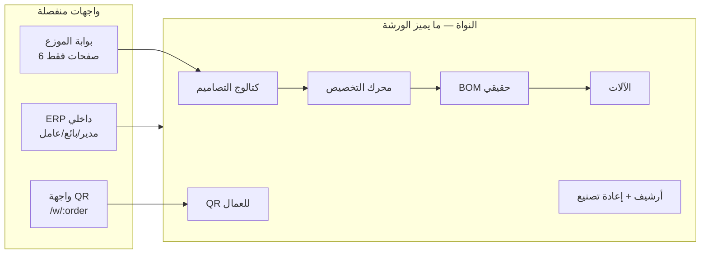
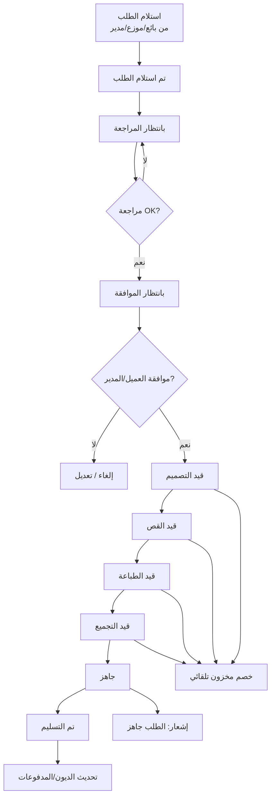
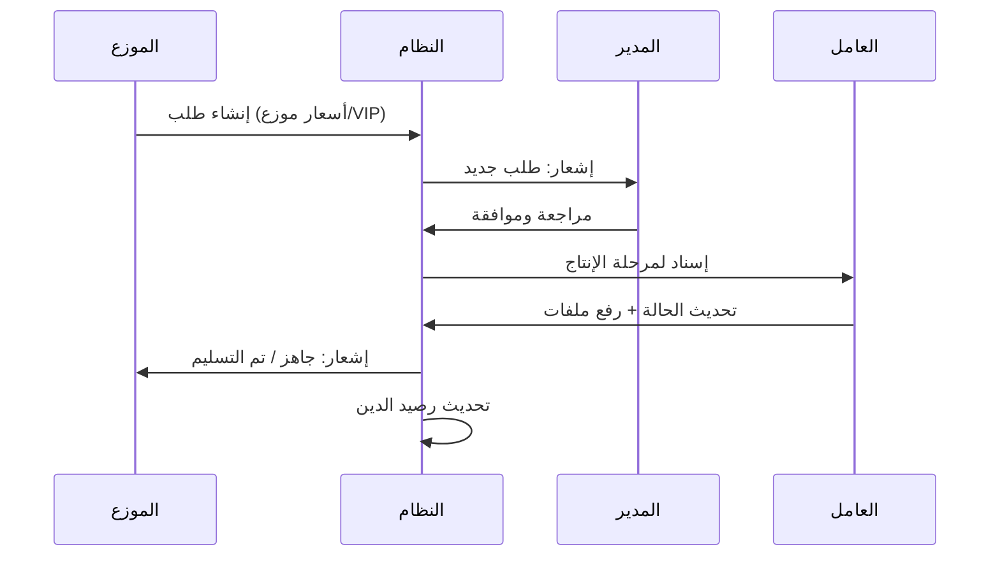
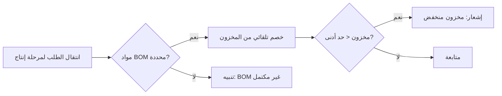
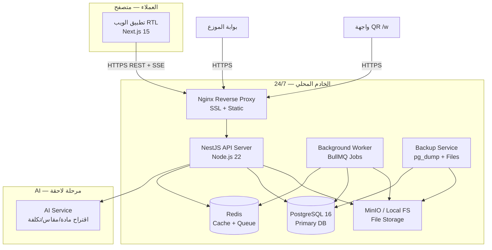
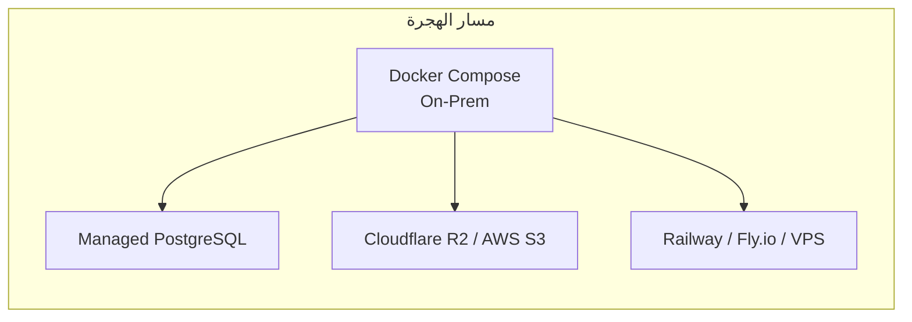
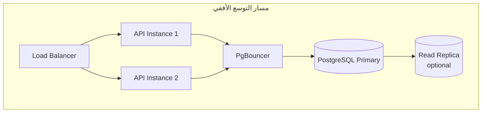

# منصة ERP لورشة التصنيع — وثيقة التصميم المعماري

> **الإصدار:** 2.0  
> **التاريخ:** 4 يوليو 2026  
> **الحالة:** مسودة للمراجعة والموافقة — **لا يبدأ التطوير البرمجي إلا بعد موافقة المستخدم**

---

## فهرس الوثائق

| الوثيقة | المحتوى |
|---------|---------|
| [DOMAIN-MODEL.md](./DOMAIN-MODEL.md) | **نموذج عمل الورشة** — تصميم ≠ منتج |
| [ARCHITECTURE.md](./ARCHITECTURE.md) | هذا الملف — نظرة عامة، التحليل، المعمارية |
| [DATABASE.md](./DATABASE.md) | مخطط ERD، الجداول، الحقول، الفهارس |
| [RBAC.md](./RBAC.md) | الأدوار، الصلاحيات، مصفوفة RBAC |
| [UI-PAGES.md](./UI-PAGES.md) | خريطة الصفحات، التنقل، UI/UX |
| [API.md](./API.md) | تصميم REST API |
| [IMPLEMENTATION.md](./IMPLEMENTATION.md) | خطة التنفيذ المرحلية |

---

## 1. تحليل المشروع الكامل

### 1.1 بيان المشكلة

تدير ورشة متعددة التخصصات (قص فوركس، حديد، ألومنيوم، طباعة، ديكور، تصنيع حسب الطلب) عملياتها حالياً عبر وسائل متفرقة: دفاتر، واتساب، ملفات محلية، وحسابات يدوية. هذا يؤدي إلى:

- فقدان أو تأخر تتبع الطلبات عبر مراحل الإنتاج
- أخطاء في التسعير بين قوائم التجزئة والجملة والموزعين
- صعوبة إدارة ملفات التصميم (AI, CDR, PDF, SVG, DXF, JPG, PNG)
- نقص في رؤية المخزون والخصم التلقائي عند التصنيع
- غياب سجل تدقيق موحد ونسخ احتياطي تلقائي
- صعوبة توسيع شبكة الموزعين (مئات الموزعين، آلاف الطلبات)

### 1.2 الأهداف

| # | الهدف | مؤشر النجاح |
|---|-------|-------------|
| 1 | توحيد إدارة الطلبات من الاستلام حتى التسليم | تتبع 100% للطلبات عبر 9 حالات |
| 2 | دعم قوائم أسعار متعددة | 4 قوائم: تجزئة، جملة، موزع، VIP |
| 3 | كتالوج تصاميم + تخصيص منظم | Design Catalog + Customization Engine |
| 4 | BOM حقيقي (مواد + عمل + آلات) | تكلفة، ربح، مواد ناقصة |
| 5 | إدارة ملفات التصميم والإنتاج | 7 أنواع ملفات مرتبطة بالإصدار والطلب |
| 6 | خصم مخزون تلقائي من BOM | مواد عند بدء الإنتاج |
| 7 | جدولة آلات + QR للعمال | Laser, CNC, UV, Plotter |
| 8 | إعادة تصنيع + versioning | أرشيف طلبات + إصدارات تصميم |
| 9 | إشعارات استباقية | 5 أنواع |
| 10 | بحث شامل | طلب، عميل، هاتف، تصميم |
| 11 | سجل تدقيق كامل | تسجيل كل عملية CRUD |
| 12 | نشر محلي 24/7 + سحابة لاحقاً | Docker + PostgreSQL |

### 1.3 أصحاب المصلحة

| صاحب المصلحة | الاهتمام |
|--------------|----------|
| **مالك الورشة / المدير** | تقارير، أرباح، صلاحيات، إعدادات |
| **البائعون** | إنشاء طلبات، متابعة العملاء، التسعير |
| **الموزعون** | طلبات بالجملة، أسعار خاصة، متابعة الديون |
| **العمال / الفنيون** | قائمة مهام الإنتاج، ملفات التصميم |
| **المحاسب** | مدفوعات، ديون، فواتير |
| **IT / DevOps** | نشر، نسخ احتياطي، صيانة |

### 1.4 أنواع المستخدمين

```
┌─────────────────────────────────────────────────────────────┐
│                      المدير (Manager)                      │
│  صلاحيات كاملة — إعدادات، تقارير، مستخدمين، جميع الطلبات   │
└─────────────────────────────────────────────────────────────┘
         │
    ┌────┴────┬──────────────┬──────────────┐
    ▼         ▼              ▼              ▼
┌────────┐ ┌────────┐  ┌────────────┐  ┌────────┐
│ بائع   │ │ موزع   │  │   عامل     │  │محاسب*  │
│ Seller │ │Distrib.│  │  Worker    │  │(اختياري)│
└────────┘ └────────┘  └────────────┘  └────────┘
```

| الدور | الوصف | نقطة الدخول |
|-------|-------|-------------|
| **المدير** | إدارة شاملة للنظام | لوحة تحكم إدارية |
| **البائع** | استقبال طلبات التجزئة، إدارة العملاء | لوحة البائع |
| **الموزع** | طلبات بالجملة، أسعار موزع/VIP | بوابة الموزع |
| **العامل** | تنفيذ مراحل الإنتاج، رفع ملفات | لوحة الإنتاج |

*\* دور المحاسب اختياري — يمكن دمجه في صلاحيات المدير أو إنشاؤه لاحقاً.*

---

## 1.5 نموذج العمل — Design-First

> التفاصيل الكاملة في [DOMAIN-MODEL.md](./DOMAIN-MODEL.md)



### 1.6 سير العمل الرئيسي



#### سير عمل إضافي: الطلب من الموزع



#### سير عمل المخزون



---

## 2. المعمارية الاحترافية

### 2.1 نظرة عامة على النظام



### 2.2 قرارات معمارية رئيسية

| القرار | الاختيار | المبرر |
|--------|----------|--------|
| **Frontend** | Next.js 15 + React 19 + TypeScript | SSR/SSG، App Router، دعم RTL ممتاز، ecosystem |
| **UI** | shadcn/ui + Tailwind CSS | مكونات احترافية، تخصيص RTL، responsive |
| **Backend** | NestJS + TypeScript | Modular architecture، DI، guards للـ RBAC |
| **ORM** | Prisma | Type-safe، migrations، PostgreSQL-first |
| **Database** | PostgreSQL 16 | ACID، JSONB، full-text search عربي |
| **Cache/Queue** | Redis 7 + BullMQ | sessions، rate limit، jobs (backup, notifications) |
| **File Storage** | MinIO (S3-compatible) | on-prem الآن، R2/S3 لاحقاً بدون تغيير API |
| **Auth** | JWT + Refresh Token | stateless، Redis blacklist للإبطال |
| **Realtime** | Server-Sent Events (SSE) | إشعارات فورية بدون تعقيد WebSocket |
| **Containerization** | Docker Compose | نشر محلي موحد، سحابة لاحقاً (Railway, AWS, DO) |

### 2.3 نموذج النشر

#### المرحلة 1: خادم محلي (الآن)

```yaml
# docker-compose.yml — ملخص
services:
  nginx:      # :443 → frontend + /api → backend
  frontend:   # Next.js production build
  api:        # NestJS
  worker:     # BullMQ processor
  postgres:   # volume: ./data/postgres
  redis:      # volume: ./data/redis
  minio:      # volume: ./data/files
  backup:     # cron: يومي 02:00
```

**متطلبات الخادم المقترحة:**
- CPU: 4 cores
- RAM: 16 GB
- Storage: 500 GB SSD (DB + ملفات)
- OS: Ubuntu 22.04 LTS
- UPS + اتصال إنترنت مستقر

#### المرحلة 2: السحابة (لاحقاً — بدون إعادة كتابة)



| المكون | On-Prem | Cloud |
|--------|---------|-------|
| PostgreSQL | Container | Supabase / RDS / Neon |
| Redis | Container | Upstash / ElastiCache |
| Files | MinIO | Cloudflare R2 |
| App | Docker | Railway / Fly.io / ECS |
| Backup | Local + optional S3 | Automated cloud backup |

**مبدأ Portability:** جميع الخدمات عبر environment variables — لا hardcoded paths.

### 2.4 قابلية التوسع

| البعد | الهدف | الآلية |
|-------|-------|--------|
| **موزعون** | 500+ | Pagination، indexes، tenant-scoped queries |
| **طلبات** | 10,000+/سنة | Partitioning by year (optional)، archival |
| **ملفات** | TB-scale | MinIO/S3، CDN later |
| **Concurrent users** | 50-100 | Redis cache، connection pooling (PgBouncer) |
| **API throughput** | 1000 req/min | Horizontal scaling of API containers |



### 2.5 الأمان

- HTTPS إلزامي (Let's Encrypt أو شهادة داخلية)
- bcrypt لتجزئة كلمات المرور (cost 12)
- RBAC على مستوى API + UI
- Rate limiting (Redis)
- Audit log لكل عملية
- File upload validation (MIME + extension + size limit)
- CORS مقيد للنطاق المعتمد
- نسخ احتياطي يومي مشفر

---

## 3. مراجع سريعة

للتفاصيل الكاملة راجع:

- **[DATABASE.md](./DATABASE.md)** — ERD + Schema كامل
- **[RBAC.md](./RBAC.md)** — مصفوفة الصلاحيات
- **[UI-PAGES.md](./UI-PAGES.md)** — الصفحات + UI/UX
- **[API.md](./API.md)** — REST API
- **[IMPLEMENTATION.md](./IMPLEMENTATION.md)** — خطة التنفيذ

---

## 4. ملاحظة هامة

> ⚠️ **هذه الوثائق تصميم معماري فقط.**  
> **لا يبدأ أي تطوير برمجي (Frontend, Backend, Database migrations, DevOps scripts) إلا بعد:**
> 1. مراجعة المستخدم لهذه الوثائق
> 2. الموافقة الصريحة على Stack والنطاق
> 3. تأكيد الأولويات في [IMPLEMENTATION.md](./IMPLEMENTATION.md)

---

*آخر تحديث: 4 يوليو 2026*
