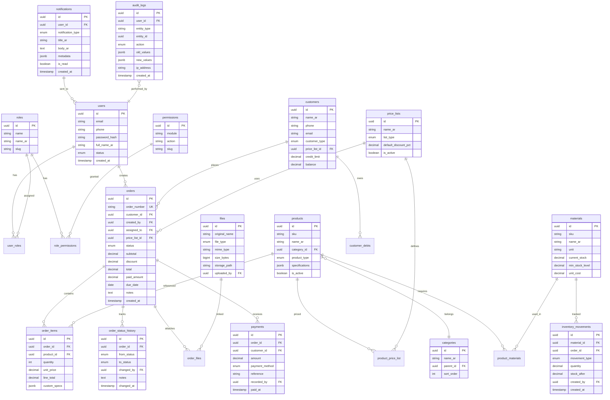
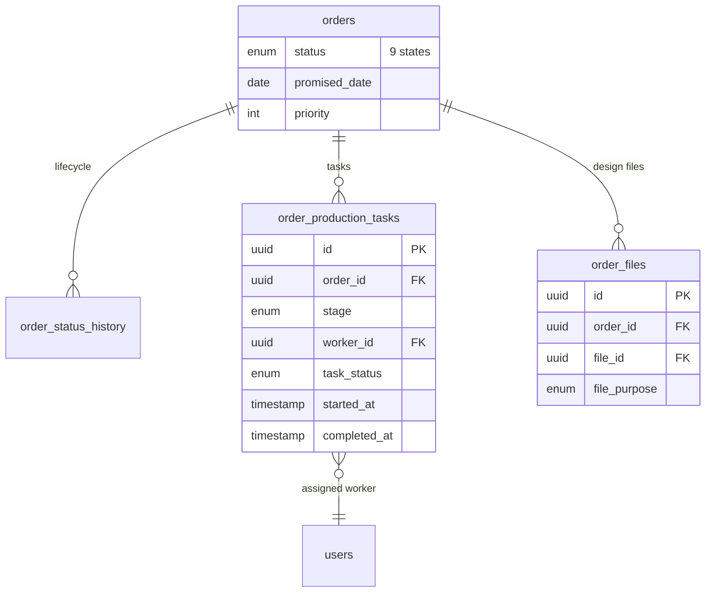
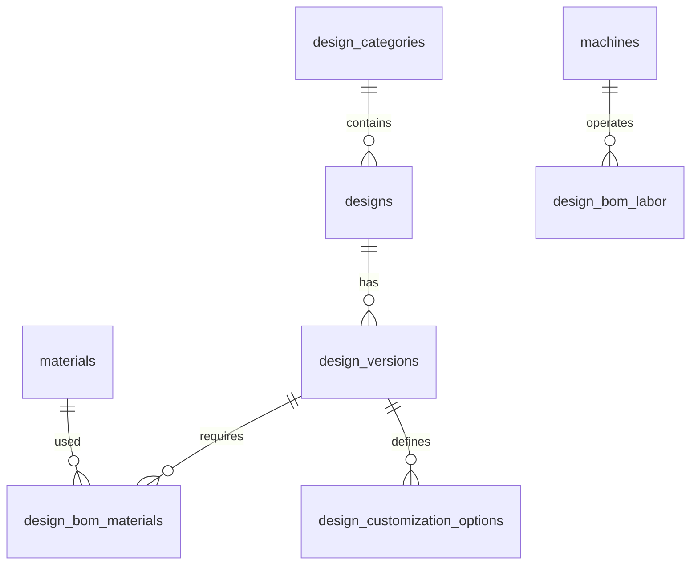
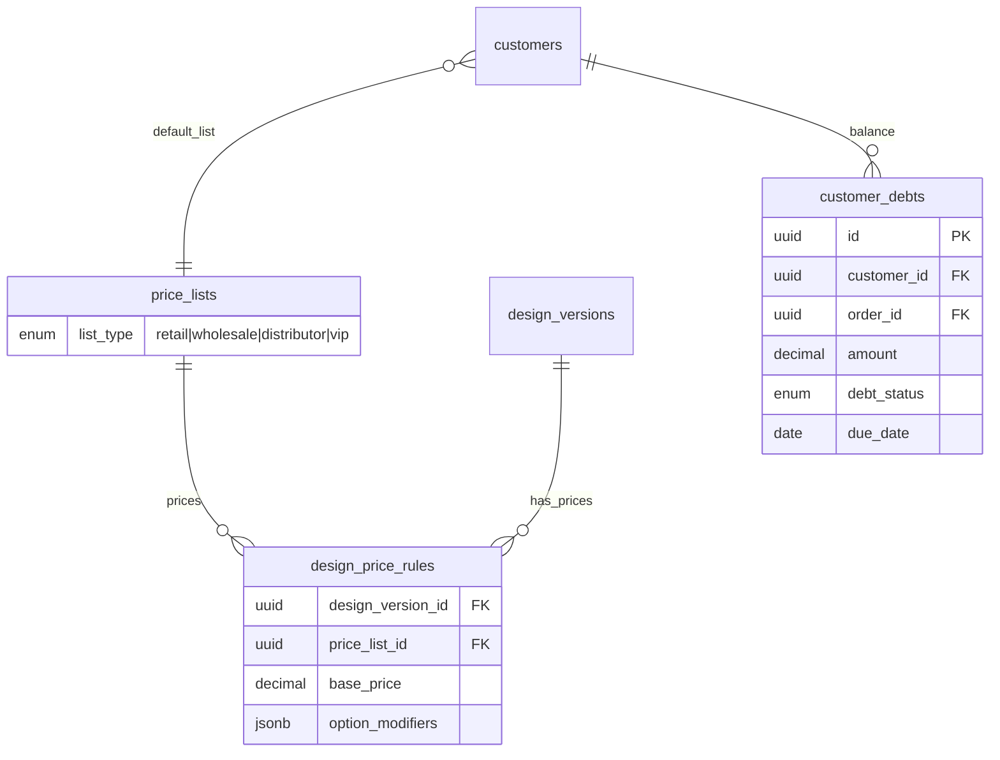
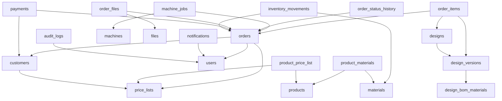

# قاعدة البيانات — ERD والمخطط الكامل

> **الإصدار:** 2.0 — مبني على [نموذج عمل الورشة](./DOMAIN-MODEL.md)  
> جزء من [وثيقة التصميم المعماري](./ARCHITECTURE.md)

---

## 0. المبدأ الأساسي: التصميم ≠ المنتج

```
designs (F125)  →  design_versions (v1,v2,v3)  →  BOM + ملفات + خيارات
                                                      ↓
order_items     ←  design_version + selected_options (لقطة ثابتة)
```

جدول `products` في v1 **أُلغي ككيان رئيسي** واستُبدل بـ:
- `designs` + `design_versions` — الكتالوج
- `product_variants` — (اختياري) متغيرات مُولَّدة للتسعير السريع
- `order_items` — يحمل `design_version_id` + `options_snapshot` JSONB

---

## 1. مخطط العلاقات (ERD)

### 1.1 نظرة عامة



### 1.2 ERD — وحدة الطلبات والإنتاج



### 1.3 ERD — كتالوج التصاميم (v2)



### 1.4 ERD — التسعير والعملاء



---

## 2. التعدادات (Enums)

```sql
-- حالات دورة حياة الطلب
CREATE TYPE order_status AS ENUM (
    'received',           -- تم استلام الطلب
    'pending_review',     -- بانتظار المراجعة
    'pending_approval',   -- بانتظار الموافقة
    'in_design',          -- قيد التصميم
    'in_cutting',         -- قيد القص
    'in_printing',        -- قيد الطباعة
    'in_assembly',        -- قيد التجميع
    'ready',              -- جاهز
    'delivered'           -- تم التسليم
);

-- أنواع قوائم الأسعار
CREATE TYPE price_list_type AS ENUM (
    'retail',       -- تجزئة
    'wholesale',    -- جملة
    'distributor',  -- موزع
    'vip'           -- VIP
);

-- أنواع الملفات
CREATE TYPE file_type AS ENUM (
    'ai', 'cdr', 'pdf', 'svg', 'dxf', 'jpg', 'png'
);

-- أنواع العملاء
CREATE TYPE customer_type AS ENUM (
    'individual', 'company', 'distributor'
);

-- أنواع المنتجات
CREATE TYPE product_type AS ENUM (
    'forex', 'iron', 'aluminum', 'printing', 'decoration', 'custom'
);

-- حركات المخزون
CREATE TYPE inventory_movement_type AS ENUM (
    'manufacturing_deduct',  -- خصم تصنيع
    'purchase_add',          -- إضافة شراء
    'adjustment',            -- تعديل يدوي
    'return'                 -- إرجاع
);

-- أنواع الإشعارات
CREATE TYPE notification_type AS ENUM (
    'new_order',
    'order_ready',
    'order_overdue',
    'debt_reminder',
    'low_stock'
);

-- حالة المستخدم
CREATE TYPE user_status AS ENUM ('active', 'inactive', 'suspended');

-- أنواع الآلات
CREATE TYPE machine_type AS ENUM (
    'laser', 'cnc', 'printer', 'uv_printer', 'plotter', 'assembly_bench', 'other'
);

-- حالة إصدار التصميم
CREATE TYPE design_version_status AS ENUM (
    'draft', 'active', 'archived'
);

-- أنواع خيارات التخصيص
CREATE TYPE customization_option_type AS ENUM (
    'select', 'multi_select', 'number', 'text', 'dimension', 'color', 'boolean'
);

-- حالة مهمة الآلة
CREATE TYPE machine_job_status AS ENUM (
    'pending', 'in_progress', 'completed', 'paused', 'cancelled'
);

-- مراحل الإنتاج لـ BOM labor
CREATE TYPE production_stage AS ENUM (
    'design', 'cutting', 'printing', 'assembly'
);
```

---

## 3. الجداول والحقول الكاملة

### 3.1 `users` — المستخدمون

| الحقل | النوع | القيود | الوصف |
|-------|-------|--------|-------|
| `id` | UUID | PK, DEFAULT gen_random_uuid() | المعرف |
| `email` | VARCHAR(255) | UNIQUE, NOT NULL | البريد |
| `phone` | VARCHAR(20) | UNIQUE | الهاتف |
| `password_hash` | VARCHAR(255) | NOT NULL | bcrypt hash |
| `full_name_ar` | VARCHAR(200) | NOT NULL | الاسم بالعربية |
| `avatar_url` | VARCHAR(500) | NULL | صورة |
| `status` | user_status | DEFAULT 'active' | الحالة |
| `last_login_at` | TIMESTAMPTZ | NULL | آخر دخول |
| `created_at` | TIMESTAMPTZ | DEFAULT NOW() | |
| `updated_at` | TIMESTAMPTZ | DEFAULT NOW() | |
| `deleted_at` | TIMESTAMPTZ | NULL | soft delete |

**Indexes:**
- `idx_users_email` ON (email)
- `idx_users_phone` ON (phone)
- `idx_users_status` ON (status) WHERE deleted_at IS NULL

---

### 3.2 `roles` — الأدوار

| الحقل | النوع | القيود |
|-------|-------|--------|
| `id` | UUID | PK |
| `name` | VARCHAR(50) | UNIQUE, NOT NULL |
| `name_ar` | VARCHAR(100) | NOT NULL |
| `slug` | VARCHAR(50) | UNIQUE — manager, seller, distributor, worker |
| `description_ar` | TEXT | NULL |
| `is_system` | BOOLEAN | DEFAULT false |
| `created_at` | TIMESTAMPTZ | DEFAULT NOW() |

**بيانات أولية:**
| slug | name_ar |
|------|---------|
| manager | مدير |
| seller | بائع |
| distributor | موزع |
| worker | عامل |

---

### 3.3 `permissions` — الصلاحيات

| الحقل | النوع | القيود |
|-------|-------|--------|
| `id` | UUID | PK |
| `module` | VARCHAR(50) | NOT NULL — orders, products, inventory... |
| `action` | VARCHAR(50) | NOT NULL — create, read, update, delete, approve |
| `slug` | VARCHAR(100) | UNIQUE — orders.create |
| `description_ar` | VARCHAR(200) | NULL |

**Index:** `idx_permissions_module` ON (module)

---

### 3.4 `role_permissions` — ربط الأدوار بالصلاحيات

| الحقل | النوع | القيود |
|-------|-------|--------|
| `role_id` | UUID | PK, FK → roles |
| `permission_id` | UUID | PK, FK → permissions |

---

### 3.5 `user_roles` — ربط المستخدمين بالأدوار

| الحقل | النوع | القيود |
|-------|-------|--------|
| `user_id` | UUID | PK, FK → users |
| `role_id` | UUID | PK, FK → roles |
| `assigned_at` | TIMESTAMPTZ | DEFAULT NOW() |
| `assigned_by` | UUID | FK → users |

---

### 3.6 `customers` — العملاء

| الحقل | النوع | القيود |
|-------|-------|--------|
| `id` | UUID | PK |
| `code` | VARCHAR(20) | UNIQUE — CUST-00001 |
| `name_ar` | VARCHAR(200) | NOT NULL |
| `phone` | VARCHAR(20) | NOT NULL |
| `phone_alt` | VARCHAR(20) | NULL |
| `email` | VARCHAR(255) | NULL |
| `address_ar` | TEXT | NULL |
| `city` | VARCHAR(100) | NULL |
| `customer_type` | customer_type | DEFAULT 'individual' |
| `price_list_id` | UUID | FK → price_lists |
| `credit_limit` | DECIMAL(15,2) | DEFAULT 0 |
| `balance` | DECIMAL(15,2) | DEFAULT 0 — رصيد الدين |
| `tax_number` | VARCHAR(50) | NULL |
| `notes` | TEXT | NULL |
| `is_active` | BOOLEAN | DEFAULT true |
| `created_by` | UUID | FK → users |
| `created_at` | TIMESTAMPTZ | DEFAULT NOW() |
| `updated_at` | TIMESTAMPTZ | DEFAULT NOW() |
| `deleted_at` | TIMESTAMPTZ | NULL |

**Indexes:**
- `idx_customers_phone` ON (phone)
- `idx_customers_name_trgm` ON (name_ar) USING gin (name_ar gin_trgm_ops) — بحث
- `idx_customers_type` ON (customer_type)
- `idx_customers_balance` ON (balance) WHERE balance > 0

---

### 3.7 `price_lists` — قوائم الأسعار

| الحقل | النوع | القيود |
|-------|-------|--------|
| `id` | UUID | PK |
| `name_ar` | VARCHAR(100) | NOT NULL |
| `list_type` | price_list_type | UNIQUE, NOT NULL |
| `default_discount_pct` | DECIMAL(5,2) | DEFAULT 0 |
| `currency` | VARCHAR(3) | DEFAULT 'DZD' |
| `is_active` | BOOLEAN | DEFAULT true |
| `valid_from` | DATE | NULL |
| `valid_until` | DATE | NULL |
| `created_at` | TIMESTAMPTZ | DEFAULT NOW() |

---

### 3.8 `design_categories` — فئات كتالوج التصاميم

| الحقل | النوع | القيود |
|-------|-------|--------|
| `id` | UUID | PK |
| `name_ar` | VARCHAR(150) | NOT NULL |
| `slug` | VARCHAR(150) | UNIQUE |
| `parent_id` | UUID | FK → design_categories, NULL |
| `sort_order` | INT | DEFAULT 0 |
| `icon` | VARCHAR(50) | NULL |
| `is_active` | BOOLEAN | DEFAULT true |

**بيانات أولية:** فوانيس، رمضان، مرايا، أسماء، واجهات، لوحات، ديكور أطفال

---

### 3.9 `designs` — التصاميم (الكيان الرئيسي)

| الحقل | النوع | القيود |
|-------|-------|--------|
| `id` | UUID | PK |
| `code` | VARCHAR(50) | UNIQUE — F125, R010 |
| `name_ar` | VARCHAR(300) | NOT NULL |
| `description_ar` | TEXT | NULL |
| `category_id` | UUID | FK → design_categories |
| `current_version_id` | UUID | FK → design_versions, NULL |
| `is_active` | BOOLEAN | DEFAULT true |
| `created_by` | UUID | FK → users |
| `created_at` | TIMESTAMPTZ | DEFAULT NOW() |
| `updated_at` | TIMESTAMPTZ | DEFAULT NOW() |
| `deleted_at` | TIMESTAMPTZ | NULL |

**Indexes:** `idx_designs_code`, `idx_designs_name_trgm`, `idx_designs_category`

---

### 3.10 `design_versions` — إصدارات التصميم

| الحقل | النوع | القيود |
|-------|-------|--------|
| `id` | UUID | PK |
| `design_id` | UUID | FK → designs, NOT NULL |
| `version_number` | INT | NOT NULL |
| `changelog` | TEXT | NULL |
| `manufacturing_time_minutes` | INT | DEFAULT 0 |
| `requires_printing` | BOOLEAN | DEFAULT false |
| `requires_assembly` | BOOLEAN | DEFAULT false |
| `requires_led` | BOOLEAN | DEFAULT false |
| `size_customizable` | BOOLEAN | DEFAULT true |
| `color_customizable` | BOOLEAN | DEFAULT true |
| `status` | design_version_status | DEFAULT 'draft' |
| `created_by` | UUID | FK → users |
| `created_at` | TIMESTAMPTZ | DEFAULT NOW() |

**Unique:** `(design_id, version_number)`

---

### 3.11 `design_version_files` — ملفات الإصدار

| الحقل | النوع | القيود |
|-------|-------|--------|
| `id` | UUID | PK |
| `design_version_id` | UUID | FK → design_versions |
| `file_id` | UUID | FK → files |
| `file_role` | VARCHAR(50) | source, cutting, preview, thumbnail |
| `sort_order` | INT | DEFAULT 0 |

---

### 3.12 `design_customization_options` — قالب خيارات التخصيص

| الحقل | النوع | القيود |
|-------|-------|--------|
| `id` | UUID | PK |
| `design_version_id` | UUID | FK → design_versions |
| `option_key` | VARCHAR(50) | size, color, material, thickness... |
| `label_ar` | VARCHAR(100) | NOT NULL |
| `option_type` | customization_option_type | NOT NULL |
| `choices` | JSONB | NULL — [{value, label_ar, price_modifier}] |
| `default_value` | VARCHAR(200) | NULL |
| `is_required` | BOOLEAN | DEFAULT true |
| `depends_on` | JSONB | NULL — {option_key, value} |
| `sort_order` | INT | DEFAULT 0 |

---

### 3.13 `design_bom_materials` — BOM المواد

| الحقل | النوع | القيود |
|-------|-------|--------|
| `id` | UUID | PK |
| `design_version_id` | UUID | FK → design_versions |
| `material_id` | UUID | FK → materials |
| `quantity` | DECIMAL(15,3) | NOT NULL |
| `unit` | VARCHAR(30) | NOT NULL |
| `waste_pct` | DECIMAL(5,2) | DEFAULT 0 |
| `condition_expr` | VARCHAR(500) | NULL — `options.led == true` |

---

### 3.14 `design_bom_labor` — BOM العمل والآلات

| الحقل | النوع | القيود |
|-------|-------|--------|
| `id` | UUID | PK |
| `design_version_id` | UUID | FK → design_versions |
| `machine_id` | UUID | FK → machines, NULL |
| `production_stage` | production_stage | NOT NULL |
| `minutes` | INT | NOT NULL |
| `condition_expr` | VARCHAR(500) | NULL |

---

### 3.15 `design_price_rules` — قواعد التسعير الديناميكي

| الحقل | النوع | القيود |
|-------|-------|--------|
| `id` | UUID | PK |
| `design_version_id` | UUID | FK → design_versions |
| `price_list_id` | UUID | FK → price_lists |
| `base_price` | DECIMAL(15,2) | NOT NULL |
| `option_modifiers` | JSONB | NULL — {size: {40: 500, 50: 800}} |

**Unique:** `(design_version_id, price_list_id)`

---

### 3.16 `machines` — الآلات

| الحقل | النوع | القيود |
|-------|-------|--------|
| `id` | UUID | PK |
| `code` | VARCHAR(50) | UNIQUE — LASER-01 |
| `name_ar` | VARCHAR(200) | NOT NULL |
| `machine_type` | machine_type | NOT NULL |
| `cost_per_minute` | DECIMAL(10,2) | DEFAULT 0 |
| `is_active` | BOOLEAN | DEFAULT true |
| `notes` | TEXT | NULL |

---

### 3.17 `machine_jobs` — مهام تشغيل الآلات

| الحقل | النوع | القيود |
|-------|-------|--------|
| `id` | UUID | PK |
| `order_id` | UUID | FK → orders |
| `order_item_id` | UUID | FK → order_items |
| `machine_id` | UUID | FK → machines |
| `worker_id` | UUID | FK → users, NULL |
| `production_stage` | production_stage | NOT NULL |
| `estimated_minutes` | INT | NOT NULL |
| `actual_minutes` | INT | NULL |
| `status` | machine_job_status | DEFAULT 'pending' |
| `started_at` | TIMESTAMPTZ | NULL |
| `completed_at` | TIMESTAMPTZ | NULL |
| `notes` | TEXT | NULL |

---

### 3.18 `ai_suggestions` — اقتراحات الذكاء الاصطناعي (مرحلة لاحقة)

| الحقل | النوع | القيود |
|-------|-------|--------|
| `id` | UUID | PK |
| `order_id` | UUID | FK → orders, NULL |
| `file_id` | UUID | FK → files — الصورة المرفوعة |
| `suggested_material` | VARCHAR(100) | NULL |
| `suggested_dimensions` | JSONB | NULL |
| `estimated_minutes` | INT | NULL |
| `estimated_cost` | DECIMAL(15,2) | NULL |
| `similar_design_ids` | UUID[] | NULL |
| `confidence` | DECIMAL(5,2) | NULL |
| `accepted` | BOOLEAN | NULL |
| `created_at` | TIMESTAMPTZ | DEFAULT NOW() |

---

### 3.19 `categories` — (مُهمَل — استخدم design_categories)

> **v2:** التصنيفات للكتالوج في `design_categories`. هذا الجدول يُحذف أو يُدمج عند التنفيذ.

---

### 3.20 `products` — (مُهمَل — استبدل بـ designs)

> **v2:** لا تُنشأ منتجات يدوية. التسعير عبر `design_price_rules`.  
> جدول `product_variants` اختياري للتخزين المؤقت للمتغيرات المُولَّدة.

#### `product_variants` (اختياري)

| الحقل | النوع | القيود |
|-------|-------|--------|
| `id` | UUID | PK |
| `design_version_id` | UUID | FK |
| `options_hash` | VARCHAR(64) | UNIQUE — hash الخيارات |
| `options` | JSONB | NOT NULL |
| `computed_price` | DECIMAL(15,2) | NULL |
| `computed_cost` | DECIMAL(15,2) | NULL |

---

### 3.10 `product_price_list` — أسعار المنتجات لكل قائمة

| الحقل | النوع | القيود |
|-------|-------|--------|
| `id` | UUID | PK |
| `product_id` | UUID | FK → products, NOT NULL |
| `price_list_id` | UUID | FK → price_lists, NOT NULL |
| `unit_price` | DECIMAL(15,2) | NOT NULL |
| `min_quantity` | INT | DEFAULT 1 |
| `updated_at` | TIMESTAMPTZ | DEFAULT NOW() |

**Unique:** `(product_id, price_list_id, min_quantity)`  
**Index:** `idx_ppl_product` ON (product_id)

---

### 3.11 `materials` — المواد الخام

| الحقل | النوع | القيود |
|-------|-------|--------|
| `id` | UUID | PK |
| `sku` | VARCHAR(50) | UNIQUE |
| `name_ar` | VARCHAR(200) | NOT NULL |
| `unit` | VARCHAR(30) | NOT NULL — م², كغ, لفة |
| `current_stock` | DECIMAL(15,3) | DEFAULT 0 |
| `min_stock_level` | DECIMAL(15,3) | DEFAULT 0 |
| `unit_cost` | DECIMAL(15,2) | DEFAULT 0 |
| `supplier_name` | VARCHAR(200) | NULL |
| `is_active` | BOOLEAN | DEFAULT true |
| `updated_at` | TIMESTAMPTZ | DEFAULT NOW() |

**Index:** `idx_materials_low_stock` ON (current_stock, min_stock_level)  
WHERE current_stock <= min_stock_level

---

### 3.12 `product_materials` — BOM (قائمة المواد)

| الحقل | النوع | القيود |
|-------|-------|--------|
| `id` | UUID | PK |
| `product_id` | UUID | FK → products |
| `material_id` | UUID | FK → materials |
| `quantity_per_unit` | DECIMAL(15,3) | NOT NULL |
| `waste_pct` | DECIMAL(5,2) | DEFAULT 0 |

**Unique:** `(product_id, material_id)`

---

### 3.13 `orders` — الطلبات

| الحقل | النوع | القيود |
|-------|-------|--------|
| `id` | UUID | PK |
| `order_number` | VARCHAR(20) | UNIQUE — ORD-2026-00001 |
| `customer_id` | UUID | FK → customers, NOT NULL |
| `created_by` | UUID | FK → users, NOT NULL |
| `assigned_to` | UUID | FK → users, NULL |
| `price_list_id` | UUID | FK → price_lists, NOT NULL |
| `status` | order_status | DEFAULT 'received' |
| `priority` | SMALLINT | DEFAULT 0 — 0=عادي, 1=عاجل, 2=فوري |
| `subtotal` | DECIMAL(15,2) | DEFAULT 0 |
| `discount_pct` | DECIMAL(5,2) | DEFAULT 0 |
| `discount_amount` | DECIMAL(15,2) | DEFAULT 0 |
| `tax_amount` | DECIMAL(15,2) | DEFAULT 0 |
| `total` | DECIMAL(15,2) | DEFAULT 0 |
| `paid_amount` | DECIMAL(15,2) | DEFAULT 0 |
| `due_date` | DATE | NULL |
| `promised_date` | DATE | NULL |
| `delivery_address` | TEXT | NULL |
| `notes` | TEXT | NULL |
| `internal_notes` | TEXT | NULL — للمو Staff فقط |
| `inventory_deducted` | BOOLEAN | DEFAULT false |
| `reorder_from_order_id` | UUID | FK → orders, NULL — إعادة تصنيع |
| `qr_code_token` | VARCHAR(64) | UNIQUE — للمسح بالهاتف |
| `created_at` | TIMESTAMPTZ | DEFAULT NOW() |
| `updated_at` | TIMESTAMPTZ | DEFAULT NOW() |
| `delivered_at` | TIMESTAMPTZ | NULL |

**Indexes:**
- `idx_orders_number` ON (order_number)
- `idx_orders_customer` ON (customer_id)
- `idx_orders_status` ON (status)
- `idx_orders_created_by` ON (created_by)
- `idx_orders_due_date` ON (due_date) WHERE status NOT IN ('delivered')
- `idx_orders_created_at` ON (created_at DESC)
- `idx_orders_search` — composite for common filters

**Trigger:** توليد `order_number` تلقائياً: `ORD-{YEAR}-{SEQ:5}`

---

### 3.14 `order_items` — بنود الطلب

| الحقل | النوع | القيود |
|-------|-------|--------|
| `id` | UUID | PK |
| `order_id` | UUID | FK → orders, ON DELETE CASCADE |
| `design_id` | UUID | FK → designs |
| `design_version_id` | UUID | FK → design_versions |
| `design_code_snapshot` | VARCHAR(50) | NOT NULL — F125 |
| `design_name_snapshot` | VARCHAR(300) | NOT NULL |
| `version_number_snapshot` | INT | NOT NULL |
| `quantity` | INT | NOT NULL, CHECK > 0 |
| `options_snapshot` | JSONB | NOT NULL — الخيارات المختارة |
| `computed_bom_snapshot` | JSONB | NULL — BOM المحسوب |
| `unit_cost` | DECIMAL(15,2) | NULL — تكلفة محسوبة |
| `unit_price` | DECIMAL(15,2) | NOT NULL |
| `margin` | DECIMAL(15,2) | NULL — unit_price - unit_cost |
| `discount_pct` | DECIMAL(5,2) | DEFAULT 0 |
| `line_total` | DECIMAL(15,2) | NOT NULL |
| `notes` | TEXT | NULL |
| `sort_order` | INT | DEFAULT 0 |

**Index:** `idx_order_items_order` ON (order_id)

---

### 3.15 `order_status_history` — سجل حالات الطلب

| الحقل | النوع | القيود |
|-------|-------|--------|
| `id` | UUID | PK |
| `order_id` | UUID | FK → orders |
| `from_status` | order_status | NULL |
| `to_status` | order_status | NOT NULL |
| `changed_by` | UUID | FK → users |
| `notes` | TEXT | NULL |
| `duration_seconds` | INT | NULL — مدة الحالة السابقة |
| `changed_at` | TIMESTAMPTZ | DEFAULT NOW() |

**Index:** `idx_order_status_order` ON (order_id, changed_at DESC)

---

### 3.16 `order_production_tasks` — مهام الإنتاج

| الحقل | النوع | القيود |
|-------|-------|--------|
| `id` | UUID | PK |
| `order_id` | UUID | FK → orders |
| `stage` | order_status | NOT NULL |
| `worker_id` | UUID | FK → users, NULL |
| `task_status` | VARCHAR(20) | pending, in_progress, completed |
| `started_at` | TIMESTAMPTZ | NULL |
| `completed_at` | TIMESTAMPTZ | NULL |
| `notes` | TEXT | NULL |

---

### 3.17 `files` — الملفات

| الحقل | النوع | القيود |
|-------|-------|--------|
| `id` | UUID | PK |
| `original_name` | VARCHAR(500) | NOT NULL |
| `stored_name` | VARCHAR(500) | NOT NULL |
| `file_type` | file_type | NOT NULL |
| `mime_type` | VARCHAR(100) | NOT NULL |
| `size_bytes` | BIGINT | NOT NULL |
| `storage_path` | VARCHAR(1000) | NOT NULL |
| `storage_bucket` | VARCHAR(100) | DEFAULT 'workshop-files' |
| `checksum_sha256` | VARCHAR(64) | NULL |
| `uploaded_by` | UUID | FK → users |
| `created_at` | TIMESTAMPTZ | DEFAULT NOW() |

**Index:** `idx_files_type` ON (file_type)

**قيود الرفع:**
| النوع | MIME | الحد الأقصى |
|-------|------|-------------|
| ai | application/postscript | 100 MB |
| cdr | application/x-coreldraw | 100 MB |
| pdf | application/pdf | 50 MB |
| svg | image/svg+xml | 10 MB |
| dxf | application/dxf | 50 MB |
| jpg | image/jpeg | 20 MB |
| png | image/png | 20 MB |

---

### 3.18 `order_files` — ملفات الطلب

| الحقل | النوع | القيود |
|-------|-------|--------|
| `id` | UUID | PK |
| `order_id` | UUID | FK → orders |
| `file_id` | UUID | FK → files |
| `file_purpose` | VARCHAR(50) | design, proof, production, delivery |
| `uploaded_at` | TIMESTAMPTZ | DEFAULT NOW() |

**Unique:** `(order_id, file_id)`

---

### 3.19 `inventory_movements` — حركات المخزون

| الحقل | النوع | القيود |
|-------|-------|--------|
| `id` | UUID | PK |
| `material_id` | UUID | FK → materials |
| `order_id` | UUID | FK → orders, NULL |
| `movement_type` | inventory_movement_type | NOT NULL |
| `quantity` | DECIMAL(15,3) | NOT NULL — سالب للخصم |
| `stock_before` | DECIMAL(15,3) | NOT NULL |
| `stock_after` | DECIMAL(15,3) | NOT NULL |
| `unit_cost_at_time` | DECIMAL(15,2) | NULL |
| `notes` | TEXT | NULL |
| `created_by` | UUID | FK → users |
| `created_at` | TIMESTAMPTZ | DEFAULT NOW() |

**Index:** `idx_inv_movements_material` ON (material_id, created_at DESC)

**منطق الخصم التلقائي (v2):**
```
عند انتقال الطلب إلى مرحلة إنتاج:
  لكل order_item:
    bom = evaluate(computed_bom_snapshot أو design_bom + options_snapshot)
    لكل مادة في bom:
      quantity_needed = item.qty × material.qty × (1 + waste_pct/100)
      INSERT inventory_movement (manufacturing_deduct)
    إنشاء machine_jobs من design_bom_labor
  SET orders.inventory_deducted = true
```

---

### 3.20 `payments` — المدفوعات

| الحقل | النوع | القيود |
|-------|-------|--------|
| `id` | UUID | PK |
| `payment_number` | VARCHAR(20) | UNIQUE — PAY-2026-00001 |
| `order_id` | UUID | FK → orders, NULL |
| `customer_id` | UUID | FK → customers, NOT NULL |
| `amount` | DECIMAL(15,2) | NOT NULL, CHECK > 0 |
| `payment_method` | payment_method | NOT NULL |
| `reference` | VARCHAR(100) | NULL — رقم شيك/تحويل |
| `notes` | TEXT | NULL |
| `recorded_by` | UUID | FK → users |
| `paid_at` | TIMESTAMPTZ | NOT NULL |
| `created_at` | TIMESTAMPTZ | DEFAULT NOW() |

**Trigger:** تحديث `orders.paid_amount` و `customers.balance` عند INSERT

---

### 3.21 `customer_debts` — الديون

| الحقل | النوع | القيود |
|-------|-------|--------|
| `id` | UUID | PK |
| `customer_id` | UUID | FK → customers |
| `order_id` | UUID | FK → orders, NULL |
| `amount` | DECIMAL(15,2) | NOT NULL |
| `paid_amount` | DECIMAL(15,2) | DEFAULT 0 |
| `due_date` | DATE | NOT NULL |
| `status` | VARCHAR(20) | open, partial, paid, overdue |
| `created_at` | TIMESTAMPTZ | DEFAULT NOW() |

**Index:** `idx_debts_overdue` ON (due_date) WHERE status IN ('open','partial','overdue')

---

### 3.22 `notifications` — الإشعارات

| الحقل | النوع | القيود |
|-------|-------|--------|
| `id` | UUID | PK |
| `user_id` | UUID | FK → users |
| `notification_type` | notification_type | NOT NULL |
| `title_ar` | VARCHAR(200) | NOT NULL |
| `body_ar` | TEXT | NOT NULL |
| `metadata` | JSONB | NULL — {order_id, order_number} |
| `is_read` | BOOLEAN | DEFAULT false |
| `read_at` | TIMESTAMPTZ | NULL |
| `created_at` | TIMESTAMPTZ | DEFAULT NOW() |

**Indexes:**
- `idx_notifications_user_unread` ON (user_id) WHERE is_read = false
- `idx_notifications_created` ON (created_at DESC)

**قواعد الإشعار:**

| النوع | المحفّز | المستلمون |
|-------|---------|-----------|
| new_order | INSERT order | manager, assigned worker |
| order_ready | status → ready | creator, customer (SMS later) |
| order_overdue | due_date < today AND status ∉ delivered | manager, creator |
| debt_reminder | debt.status = overdue | manager, customer owner |
| low_stock | stock <= min_level | manager |

---

### 3.23 `audit_logs` — سجل التدقيق

| الحقل | النوع | القيود |
|-------|-------|--------|
| `id` | UUID | PK |
| `user_id` | UUID | FK → users, NULL |
| `user_email` | VARCHAR(255) | NULL — snapshot |
| `entity_type` | VARCHAR(50) | NOT NULL |
| `entity_id` | UUID | NOT NULL |
| `action` | VARCHAR(20) | create, update, delete, login, export |
| `old_values` | JSONB | NULL |
| `new_values` | JSONB | NULL |
| `ip_address` | INET | NULL |
| `user_agent` | VARCHAR(500) | NULL |
| `created_at` | TIMESTAMPTZ | DEFAULT NOW() |

**Indexes:**
- `idx_audit_entity` ON (entity_type, entity_id)
- `idx_audit_user` ON (user_id, created_at DESC)
- `idx_audit_created` ON (created_at DESC)

**Partitioning (اختياري):** BY RANGE (created_at) — شهري

---

### 3.24 `refresh_tokens` — رموز التحديث

| الحقل | النوع | القيود |
|-------|-------|--------|
| `id` | UUID | PK |
| `user_id` | UUID | FK → users |
| `token_hash` | VARCHAR(255) | UNIQUE |
| `expires_at` | TIMESTAMPTZ | NOT NULL |
| `revoked_at` | TIMESTAMPTZ | NULL |
| `created_at` | TIMESTAMPTZ | DEFAULT NOW() |

---

### 3.25 `system_settings` — إعدادات النظام

| الحقل | النوع | القيود |
|-------|-------|--------|
| `key` | VARCHAR(100) | PK |
| `value` | JSONB | NOT NULL |
| `description_ar` | VARCHAR(300) | NULL |
| `updated_by` | UUID | FK → users |
| `updated_at` | TIMESTAMPTZ | DEFAULT NOW() |

**إعدادات أولية:**
| key | value |
|-----|-------|
| backup.schedule | "0 2 * * *" |
| backup.retention_days | 30 |
| order.number_prefix | "ORD" |
| notifications.overdue_check_hours | 24 |
| inventory.auto_deduct_stages | ["in_design"] |

---

### 3.26 `backups` — سجل النسخ الاحتياطي

| الحقل | النوع | القيود |
|-------|-------|--------|
| `id` | UUID | PK |
| `backup_type` | VARCHAR(20) | full, incremental |
| `file_path` | VARCHAR(1000) | NOT NULL |
| `size_bytes` | BIGINT | NULL |
| `status` | VARCHAR(20) | running, completed, failed |
| `started_at` | TIMESTAMPTZ | NOT NULL |
| `completed_at` | TIMESTAMPTZ | NULL |
| `error_message` | TEXT | NULL |

---

## 4. البحث الموحد (Full-Text Search)

```sql
-- View للبحث السريع
CREATE VIEW search_index AS
SELECT
    'order' AS entity_type,
    o.id AS entity_id,
    o.order_number AS primary_text,
    c.name_ar AS secondary_text,
    c.phone AS tertiary_text,
    o.created_at
FROM orders o
JOIN customers c ON c.id = o.customer_id

UNION ALL

SELECT
    'design',
    d.id,
    d.code,
    d.name_ar,
    NULL,
    d.created_at
FROM designs d
WHERE d.deleted_at IS NULL;

CREATE INDEX idx_search_primary ON search_index USING gin (primary_text gin_trgm_ops);
CREATE INDEX idx_search_secondary ON search_index USING gin (secondary_text gin_trgm_ops);
```

**حقول البحث المدعومة:**
1. رقم الطلب (`order_number`)
2. اسم العميل (`customers.name_ar`)
3. هاتف العميل (`customers.phone`)
4. اسم التصميم (`designs.name_ar`)
5. رقم التصميم (`designs.code`)

---

## 5. قيود المرجعية (Foreign Keys Summary)



---

[← العودة للمعمارية](./ARCHITECTURE.md) | [الصلاحيات →](./RBAC.md)
