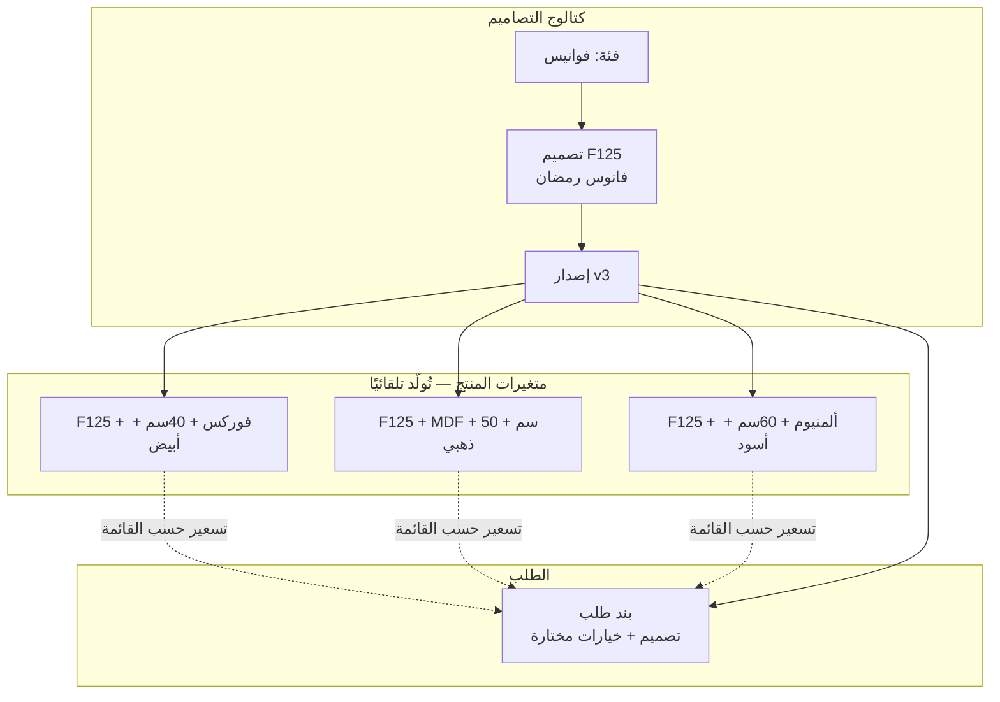
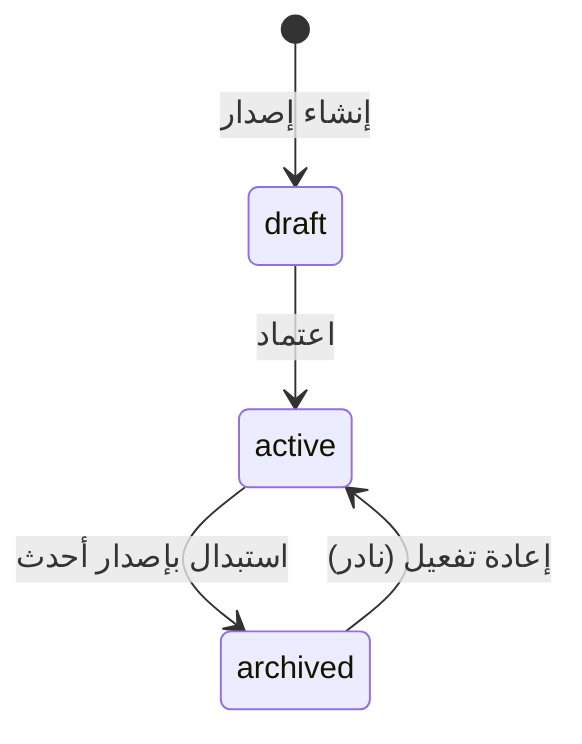
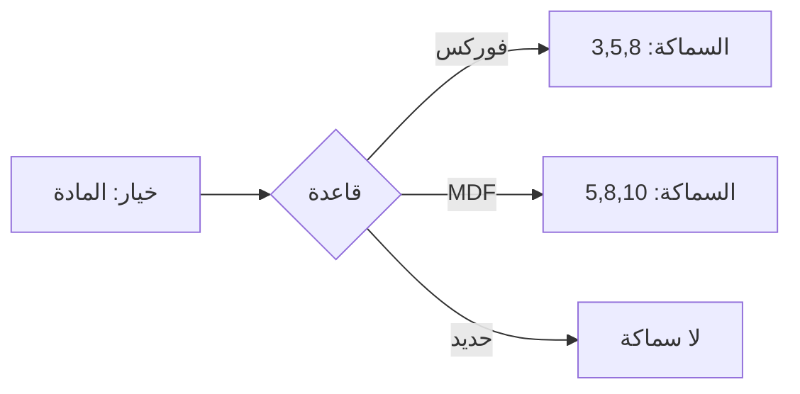
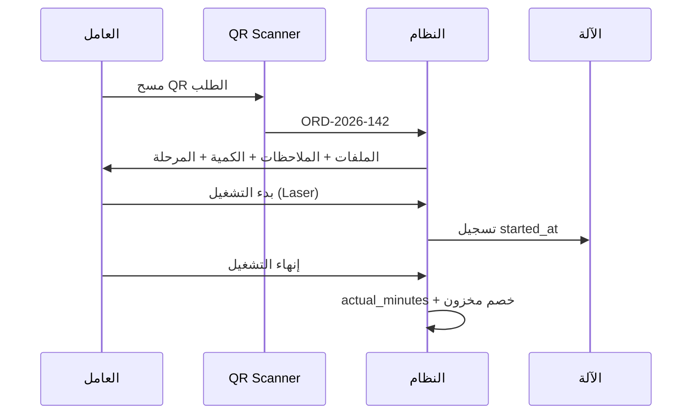
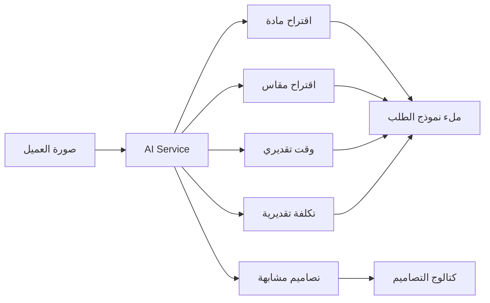
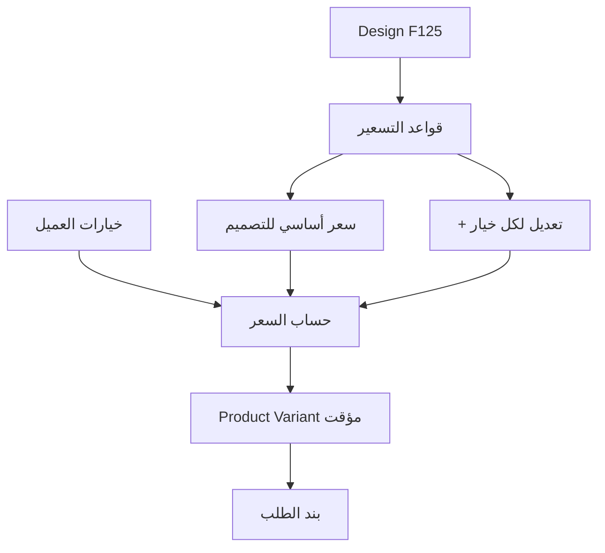
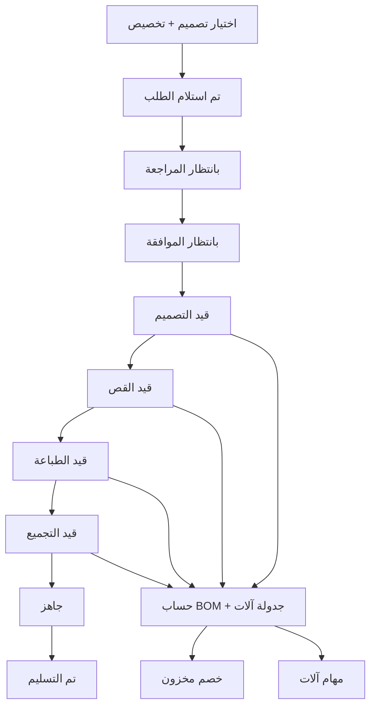
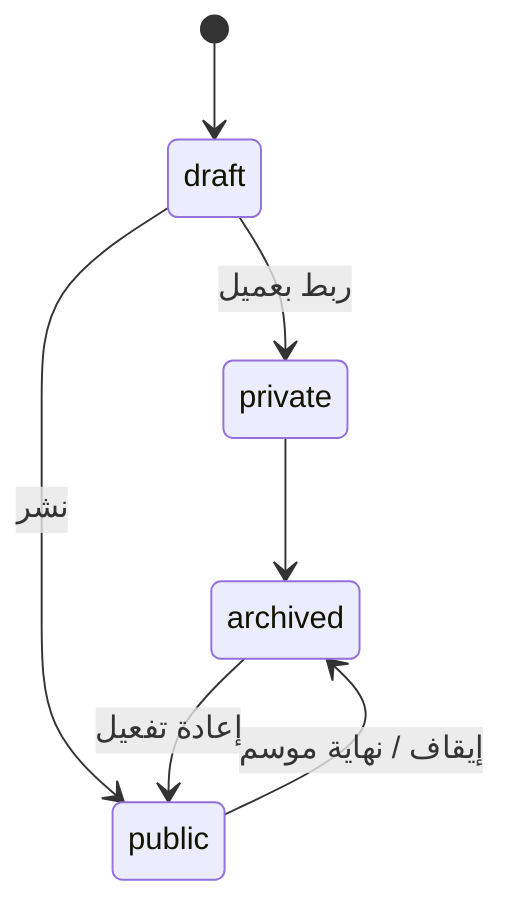
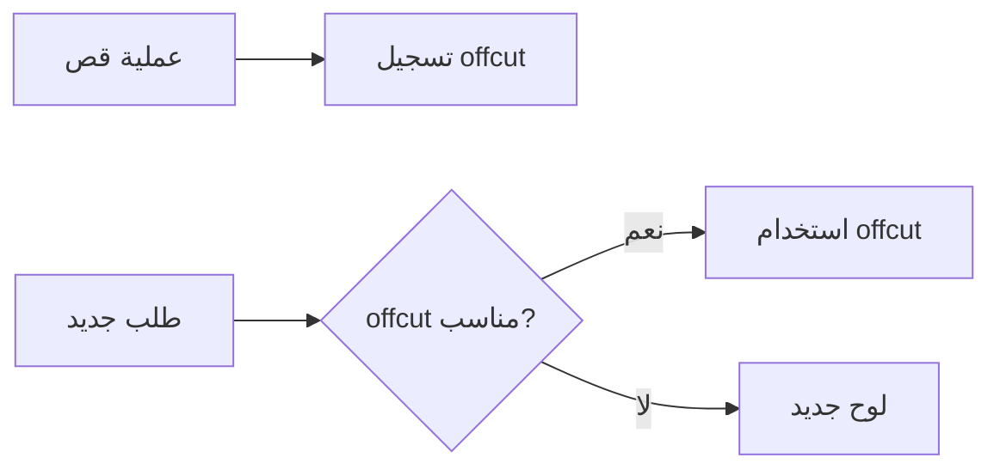

# DecoZR ERP — نموذج عمل الورشة

> **المنتج:** DecoZR ERP  
> **الإصدار:** 3.0  
> **التاريخ:** 4 يوليو 2026  
> **الحالة:** مسودة للمراجعة — **لا يبدأ التطوير البرمجي إلا بعد الموافقة**

---

## لماذا هذه الوثيقة؟

الوثائق التقنية السابقة (v1.0) صمّمت نظام ERP **صحيحًا معماريًا** لكنه يعامل «المنتج» ككيان تجاري تقليدي — كما في المتاجر الإلكترونية.

**في ورشتك الواقع مختلف:**

| ERP تقليدي | ورشتك |
|------------|-------|
| منتج = SKU واحد | **تصميم** واحد يولّد عشرات المنتجات |
| BOM بسيط (مواد فقط) | BOM = مواد + وقت قص + وقت تجميع + آلات |
| ملاحظات نصية للتخصيص | **محرك تخصيص** منظم بخيارات |
| كتالوج منتجات | **كتالوج تصاميم** مع ملفات إنتاج |
| نفس الواجهة للجميع | **بوابة موزع** منفصلة وبسيطة |
| لا أرشيف | **إعادة تصنيع** من طلبات سابقة |
| لا إصدارات | **Versioning** للتصاميم |

> **القاعدة الذهبية:**  
> **التصميم (Design) ≠ المنتج (Product Variant)**  
> التصميم = *ماذا نصنع* | المنتج = *بأي مادة ومقاس ولون*

---

## 1. الفصل الإلزامي: التصميم vs المنتج



### مثال عملي

```
تصميم: فانوس F125 (رمضان 2025)
├── يمكن إنتاجه بـ: فوركس | MDF | حديد | ألمنيوم
├── المقاسات: 30 | 40 | 50 | 60 سم
├── الألوان: أبيض | أسود | ذهبي
└── = 4 مواد × 4 مقاسات × 3 ألوان = 48 منتجًا محتملًا

بدون الفصل: 48 سجل منتج مكرر بنفس التصميم والملفات!
مع الفصل: 1 تصميم + قواعد توليد + تسعير ديناميكي
```

### تعريفات

| المصطلح | التعريف | مثال |
|---------|---------|------|
| **Design Category** | تصنيف شجري للتصاميم | فوانيس → رمضان |
| **Design** | هوية التصميم الثابتة | فانوس F125 |
| **Design Version** | نسخة محددة من التصميم (لا تُحذف) | F125 v1, v2, v3 |
| **Product Variant** | تركيبة قابلة للبيع = تصميم + خيارات | F125-v3 + فوركس + 40سم |
| **Customization** | خيارات يختارها العميل عند الطلب | مقاس، لون، اسم مطبوع |
| **BOM** | قائمة مواد + عمل + آلات للإصدار | 0.7م فوركس + 15د قص |

---

## 2. كتالوج التصاميم (Design Catalog)

### 2.1 الهيكل الشجري

```
كتالوج التصاميم
├── فوانيس
│   ├── فانوس F001
│   ├── فانوس F002
│   └── فانوس F003
├── رمضان
│   ├── هلال R010
│   └── نجمة R011
├── مرايا
├── أسماء
├── واجهات
├── لوحات
└── ديكور أطفال
```

### 2.2 بيانات كل تصميم (Design)

| الحقل | الوصف |
|-------|-------|
| `code` | رقم التصميم — F125, R010 |
| `name_ar` | الاسم بالعربية |
| `category_id` | الفئة |
| `description_ar` | الوصف |
| `current_version_id` | الإصدار الحالي للعرض |
| `is_active` | نشط في الكتالوج |

### 2.3 بيانات كل إصدار (Design Version)

| الحقل | الوصف |
|-------|-------|
| `version_number` | 1, 2, 3... |
| `changelog` | ما تغيّر في هذا الإصدار |
| `images[]` | صور متعددة للعرض |
| `files[]` | AI, CDR, SVG, DXF, PDF |
| `manufacturing_time_minutes` | وقت التصنيع الإجمالي |
| `requires_printing` | هل يحتاج طباعة؟ |
| `requires_assembly` | هل يحتاج تجميع؟ |
| `requires_led` | هل يحتاج إضاءة LED؟ |
| `size_customizable` | هل المقاس قابل للتعديل؟ |
| `color_customizable` | هل اللون قابل للتغيير؟ |
| `bom_id` | قائمة المواد والعمل |
| `status` | draft \| active \| archived |

**قاعدة الإصدارات:** عند تعديل تصميم → إنشاء **إصدار جديد**، الإصدارات القديمة تبقى للإعادة التصنيع.



---

## 3. محرك التخصيص (Customization Engine)

بدلاً من حقل «ملاحظات» فقط، كل تصميم يعرّف **قالب خيارات**:

### 3.1 أنواع الخيارات

| النوع | الوصف | مثال |
|-------|-------|------|
| `select` | اختيار واحد من قائمة | المادة: فوركس / MDF |
| `multi_select` | اختيار متعدد | إكسسوارات إضافية |
| `number` | رقم | السماكة: 3, 5, 8 |
| `text` | نص حر | الاسم المطبوع |
| `dimension` | مقاس (عرض × ارتفاع) | 40 × 60 سم |
| `color` | لون | أبيض، أسود، ذهبي |
| `boolean` | نعم/لا | إضافة LED؟ |

### 3.2 مثال: فانوس F125

```
☑ المقاس (select)     → 30 | 40 | 50 | 60 سم
☑ اللون (color)       → أبيض | أسود | ذهبي
☑ المادة (select)     → فوركس | MDF | حديد | ألمنيوم
☑ السماكة (select)    → 3 | 5 | 8 | 10 مم
☑ الاسم المطبوع (text)→ .................
☑ LED (boolean)       → نعم / لا
```

### 3.3 قواعد التخصيص



- **تبعية الخيارات:** اختيار «حديد» يخفي خيار «السماكة»
- **تأثير على BOM:** اختيار «LED = نعم» يضيف 2م LED للـ BOM
- **تأثير على السعر:** كل خيار قد يضيف/يخصم مبلغًا
- **تأثير على الآلة:** «فوركس» → Laser | «حديد» → CNC

### 3.4 لقطة الطلب (Order Snapshot)

عند إنشاء الطلب تُحفظ الخيارات المختارة **كـ JSON ثابت** — حتى لو تغيّر التصميم لاحقًا:

```json
{
  "design_code": "F125",
  "design_version": 2,
  "options": {
    "size": "40",
    "color": "gold",
    "material": "forex",
    "thickness": "5",
    "printed_name": "محمد",
    "led": true
  },
  "computed_bom": { ... },
  "unit_price": 8500,
  "price_list": "distributor"
}
```

---

## 4. BOM الحقيقي (Bill of Materials)

### 4.1 مكونات BOM

```
تصميم F125 — إصدار v3
├── مواد (Materials)
│   ├── 0.7 متر فوركس (لكل وحدة)
│   ├── 2 متر LED (إذا led=true)
│   ├── 4 براغي
│   └── 20 غرام غراء
├── عمل (Labor)
│   ├── 15 دقيقة قص (Laser)
│   ├── 10 دقيقة طباعة (UV) — إذا requires_printing
│   └── 30 دقيقة تجميع
└── آلات (Machines)
    ├── Laser — 15 دقيقة
    └── Assembly bench — 30 دقيقة
```

### 4.2 جداول BOM

| الجدول | المحتوى |
|--------|---------|
| `design_bom_materials` | مادة + كمية + وحدة + شرط (conditional) |
| `design_bom_labor` | نوع عمل + دقائق + مرحلة إنتاج |
| `design_bom_machines` | آلة + دقائق تشغيل + مرحلة |

### 4.3 BOM الشرطي (Conditional BOM)

```yaml
- material: forex_sheet
  quantity: 0.7
  unit: meter
  condition: "options.material == 'forex'"

- material: led_strip
  quantity: 2
  unit: meter
  condition: "options.led == true"

- labor: cutting
  minutes: 15
  machine: laser
  condition: "options.material in ['forex','mdf']"
```

### 4.4 ما يُمكّنه BOM الحقيقي

| القدرة | كيف |
|--------|-----|
| **تكلفة المنتج** | Σ(كمية × سعر المادة) + Σ(دقائق × تكلفة دقيقة) |
| **الربح الحقيقي** | سعر البيع − التكلفة المحسوبة |
| **المواد الناقصة** | مقارنة BOM المحسوب × الكمية مع المخزون |
| **خصم المخزون** | عند بدء الإنتاج: خصم تلقائي حسب BOM المحسوب |
| **جدولة الآلات** | تقدير وقت التشغيل الإجمالي |

### 4.5 حساب التكلفة

```
تكلفة الوحدة =
  Σ (كمية_مادة × unit_cost_مادة)
+ Σ (دقائق_عمل × cost_per_minute)
+ Σ (دقائق_آلة × machine_cost_per_minute)

هامش الربح = سعر_البيع − تكلفة_الوحدة
```

---

## 5. الآلات وجدولة الإنتاج (Machines)

### 5.1 جدول الآلات

| الكود | الاسم | النوع | تكلفة/دقيقة |
|-------|-------|-------|-------------|
| LASER-01 | ليزر رئيسي | laser | 50 د.ج |
| CNC-01 | CNC حديد | cnc | 80 د.ج |
| UV-01 | طابعة UV | uv_printer | 30 د.ج |
| PLOT-01 | بلوتر | plotter | 25 د.ج |
| PRINT-01 | طابعة عادية | printer | 15 د.ج |

### 5.2 مهمة آلة (Machine Job)

كل بند طلب يولّد **مهام آلات** حسب BOM:

| الحقل | الوصف |
|-------|-------|
| `order_item_id` | بند الطلب |
| `machine_id` | الآلة المطلوبة |
| `worker_id` | العامل المسؤول |
| `estimated_minutes` | المدة المتوقعة |
| `actual_minutes` | المدة الفعلية |
| `started_at` | وقت البداية |
| `completed_at` | وقت النهاية |
| `status` | pending \| in_progress \| completed \| paused |



---

## 6. أرشيف التصاميم وإعادة التصنيع

### 6.1 السيناريو

```
2025: العميل طلب «فانوس رمضان F125» — مقاس 50، ذهبي، فوركس
2026: العميل يضغط «إعادة تصنيع»
```

### 6.2 ما يحدث

1. النظام يجلب **لقطة الطلب الأصلية** (design_version + options + files)
2. يعرض للعميل/البائع نفس الخيارات مع إمكانية التعديل
3. ينشئ طلبًا جديدًا مرتبطًا بالأصل: `reorder_from_order_id`
4. يستخدم **نفس إصدار التصميم** (v2) حتى لو الإصدار الحالي v3


### 6.3 واجهة «طلباتي السابقة»

| العمود | المحتوى |
|--------|---------|
| التاريخ | 15 رمضان 2025 |
| التصميم | فانوس F125 |
| الخيارات | 50سم، ذهبي، فوركس |
| [إعادة تصنيع] | زر |

---

## 7. بوابة الموزع (نسخة العميل)

الموزع **لا يرى ERP**. يرى تطبيقًا بسيطًا:

```
┌─────────────────────────────┐
│  🏭 ورشتنا                  │
├─────────────────────────────┤
│  📚 الكتالوج                │
│  ➕ طلب جديد                │
│  📋 طلباتي                  │
│  💳 ديوني                   │
│  🧾 الفواتير                │
│  🔔 التنبيهات               │
└─────────────────────────────┘
```

### 7.1 الفصل التقني

| ERP الداخلي | بوابة الموزع |
|-------------|--------------|
| `/dashboard` | `/portal` |
| كل الوحدات | 6 صفحات فقط |
| Sidebar كامل | Bottom navigation (mobile) |
| إدارة، تقارير، مخزون | **مخفي تمامًا** |

### 7.2 تجربة الكتالوج للموزع

- تصفح بالفئات (فوانيس، رمضان...)
- صور التصميم
- أسعار الموزع (أو VIP)
- اختيار الخيارات (محرك التخصيص)
- رفع ملفات إضافية
- إرسال الطلب

---

## 8. QR Code للعمال

### 8.1 التوليد

كل طلب يُطبع معه **QR Code** يحتوي:
```
https://workshop.local/w/ORD-2026-00142
```

### 8.2 عند المسح (العامل)

```
┌─────────────────────────────────────┐
│  ORD-2026-142          🔴 عاجل      │
│  فانوس F125 × 3                     │
├─────────────────────────────────────┤
│  المرحلة: قيد القص                  │
│  الآلة: Laser-01                    │
├─────────────────────────────────────┤
│  📎 design_v2.ai                    │
│  📎 cutting_path.dxf                │
│  📎 proof.pdf                       │
├─────────────────────────────────────┤
│  📝 ملاحظات: الاسم «محمد» ذهبي      │
│  📐 50سم × فوركس 5مم + LED          │
├─────────────────────────────────────┤
│  [▶ بدء]  [📷 صورة]  [✅ إنهاء]    │
└─────────────────────────────────────┘
```

### 8.3 الوصول

- مسار `/w/:orderNumber` — واجهة مبسطة للعامل (mobile-first)
- لا يحتاج تنقل في ERP
- يعمل من كاميرا الهاتف

---

## 9. الذكاء الاصطناعي (مرحلة مستقبلية — مُصمَّم مسبقًا)

### 9.1 المرحلة 1: اقتراح من صورة

```
العميل يرفع صورة → AI يقترح:
├── المادة المناسبة (فوركس / MDF / ...)
├── المقاس التقريبي
├── الوقت المتوقع للتصنيع
└── التكلفة التقريبية
```

### 9.2 المرحلة 2: تصاميم مشابهة

```
بحث بالصورة → عرض تصاميم من الكتالوج مشابهة
```

### 9.3 التصميم المعماري للـ AI



**ملاحظة:** الـ AI **اختياري** في التنفيذ — لكن الجداول والـ API مصممة لاستقباله لاحقًا دون إعادة هيكلة.

| جدول | الغرض |
|------|-------|
| `ai_suggestions` | حفظ اقتراحات AI لكل طلب/صورة |
| `design_embeddings` | vectors للبحث بالتشابه (مرحلة 2) |

---

## 10. توليد المنتجات (Product Variants)

### 10.1 لا تُنشأ يدويًا

```
❌ خطأ: إنشاء 48 منتجًا لـ F125 يدويًا
✅ صحيح: قواعد توليد من التصميم + الخيارات
```

### 10.2 آلية التوليد



### 10.3 التسعير الديناميكي

```
سعر البيع =
  سعر_أساسي_التصميم (حسب قائمة الأسعار)
+ تعديل_المقاس[size]
+ تعديل_المادة[material]
+ تعديل_LED[led]
+ تعديل_السماكة[thickness]
```

قوائم الأسعار (تجزئة، جملة، موزع، VIP) تطبّق على **السعر المحسوب**.

---

## 11. دورة حياة الطلب (محدّثة)



**فرق عن v1.0:** الطلب يبدأ بـ **تصميم + خيارات** وليس «منتج SKU».

---

## 12. ملخص التغييرات عن v1.0

| v1.0 | v2.0 |
|------|------|
| `products` ككيان رئيسي | `designs` + `design_versions` ككيان رئيسي |
| `product_materials` BOM بسيط | `design_bom_*` مواد + عمل + آلات |
| `custom_specs` JSON حر | `customization_options` منظمة |
| كتالوج منتجات | كتالوج تصاميم |
| واجهة موحدة | بوابة موزع منفصلة |
| لا QR | QR لكل طلب |
| لا إصدارات | Design Versioning |
| لا إعادة تصنيع | أرشيف + reorder |
| لا آلات | `machines` + `machine_jobs` |
| AI في roadmap بعيد | AI مُصمَّم في النموذج |

---

## 13. الوثائق المرتبطة

| الوثيقة | المحتوى |
|---------|---------|
| [WORKSPACE.md](./WORKSPACE.md) | **مساحة عمل الطلب** — الميزة الثورية |
| [DATABASE.md](./DATABASE.md) | Schema v3 |
| [RBAC.md](./RBAC.md) | صلاحيات |
| [UI-PAGES.md](./UI-PAGES.md) | واجهات + تقويم |
| [API.md](./API.md) | endpoints |
| [IMPLEMENTATION.md](./IMPLEMENTATION.md) | 8 مراحل |

---

## 14. مستودع التصاميم (Design Library)

ليس كل تصميم معروضًا للبيع.

| الحالة | الوصف | يظهر في الكتالوج؟ |
|--------|-------|-------------------|
| `draft` | تجريبي، قيد الإعداد | ❌ |
| `private` | خاص (عميل واحد) | ❌ إلا لصاحبه |
| `public` | للبيع للجميع | ✅ |
| `archived` | موقوف / موسم انتهى | ❌ (أرشيف فقط) |



**حقل:** `designs.library_status` — منفصل عن `design_version_status` (draft/active/archived للإصدار).

---

## 15. إدارة حقوق التصميم (Design Rights)

| الحقل | الوصف |
|-------|-------|
| `owner_type` | `workshop` \| `customer` |
| `owner_customer_id` | إن كان ملك عميل — FK → customers |
| `visibility` | `private` \| `public` |
| `sell_policy` | `owner_only` \| `workshop_only` \| `everyone` |

### مثال: شعار شركة X

```yaml
design: LOGO-X-001
owner_type: customer
owner_customer_id: شركة X
library_status: private
sell_policy: owner_only
```

→ لا يظهر لأي موزع آخر. فقط شركة X والمدير يرونه.

### قواعد العرض

| sell_policy | من يرى في الكتالوج |
|-------------|-------------------|
| `everyone` | الجميع (إن public) |
| `workshop_only` | بائعون + مدير (لا موزعون) |
| `owner_only` | المالك + المدير فقط |

---

## 16. حجز الطاقة الإنتاجية (Capacity Planning)

أبعد من جدولة الآلة — **هل نستطيع الوفاء بالموعد؟**

```
آلة Laser: سعة يومية = 8 ساعات (480 دقيقة)
مهام اليوم: 14 ساعة مطلوبة (840 دقيقة)
→ ⚠️ العجز: 6 ساعات → التسليم المتوقع: غدًا
```

| المفهوم | الوصف |
|---------|-------|
| `machines.daily_capacity_minutes` | سعة يومية افتراضية |
| `machine_jobs.estimated_minutes` | طلب على السعة |
| `capacity_snapshots` | لقطة يومية: مطلوب vs متاح |

**عند وعد العميل:** النظام يحسب `promised_date` من السعة المتبقية — لا وعود يدوية مستحيلة.

```
GET /capacity/forecast?from=2026-07-05&days=7
→ [{date, machine_id, required_min, available_min, overload}]
```

---

## 17. التقويم الإنتاجي (Production Calendar)

شاشة مثل **Google Calendar** — عرض يومي/أسبوعي لمهام الآلات.

```
الاثنين 7 يوليو — Laser-01
├── 09:00–10:30  ORD-142  محمد
├── 10:30–11:45  ORD-138  أحمد
└── 11:45–13:00  ORD-135  موزع الكبير
```

- مصدر البيانات: `machine_jobs` + `capacity_snapshots`
- مسار: `/calendar` — مدير + مشرف إنتاج
- سحب وإفلات لإعادة الجدولة (مع فحص السعة)

---

## 18. إدارة القصاصات (Offcuts)

**يوفر آلاف الدنانير سنويًا** في الفوركس والألمنيوم.

```
لوح أصلي: 244 × 122 سم
قُصَّت قطعة: 180 × 42
بقي offcut: 64 × 80 سم → سجّله في المخزون
```

| الحقل | الوصف |
|-------|-------|
| `material_id` | نوع المادة |
| `width_cm`, `height_cm` | أبعاد القصاصة |
| `source_order_id` | من أي طلب |
| `status` | `available` \| `reserved` \| `used` |
| `used_in_order_id` | طلب استخدمها |

**عند حساب BOM:** النظام يبحث أولًا عن offcut مناسب قبل خصم لوح كامل.



---

## 19. سجل صيانة الآلات

| الحقل | الوصف |
|-------|-------|
| `machines.last_maintenance_at` | آخر صيانة |
| `machines.next_maintenance_at` | الصيانة القادمة |
| `machines.operational_status` | `operational` \| `maintenance` \| `broken` |
| `machine_maintenance_logs` | سجل تفصيلي |

**قاعدة:** إذا `operational_status != operational` → **لا تُوزَّع** مهام جديدة على الآلة.

```
Laser-01: صيانة مجدولة 1 أغسطس → من 31 يوليو: تنبيه + استبعاد من الجدولة
```

---

## 20. نظام المواسم (Seasons)

| الموسم | مثال | Start | End | Priority |
|--------|------|-------|-----|----------|
| رمضان | رمضان 2027 | 2027-02-01 | 2027-03-30 | 10 |
| أعراس | موسم صيف 2027 | 2027-06-01 | 2027-09-30 | 8 |
| مدارس | rentrée 2027 | 2027-08-15 | 2027-09-15 | 7 |

- جدول `seasons` + `design_seasons` (ربط تصاميم بموسم)
- في موسم رمضان: الكتالوج يُرتّب بتصاميم `design_seasons` ذات الأولوية
- `library_status: archived` تلقائيًا بعد `season.end` (اختياري)

---

## 21. التسعير الذكي (Smart Pricing)

بدل سعر ثابت — **صيغة محسوبة** تتكيف مع تكلفة المواد:

```
السعر النهائي =
  تكلفة_المادة (مساحة × سعر/م²)
+ تكلفة_القص (محيط × سعر/م)
+ وقت_الآلة (دقائق × cost_per_minute)
+ تكلفة_الطباعة (إن وُجدت)
+ هامش_الربح (%)
```

| المكوّن | المصدر |
|---------|--------|
| المساحة | من `options_snapshot` (مقاس) |
| المادة | `materials.unit_cost` محدّث |
| القص | من BOM labor |
| الآلة | `machines.cost_per_minute` |
| الربح | `design_price_rules.margin_pct` أو عام |

**فائدة:** عند ارتفاع سعر الفوركس → الأسعار تُحدَّث تلقائيًا دون تعديل يدوي لكل تصميم.

`POST /designs/calculate-price` — ينفّذ الصيغة ويعيد تفصيل السعر.

---

## 22. سجل العميل — Timeline

أبعد من قائمة الطلبات — **خط زمني تفاعلي**:

```
customer_activities:
  15/03  أنشأ طلب ORD-140
  18/03  دفع عربون 5,000 د.ج
  20/03  اتصال — استفسار عن الموعد (يدوي: بائع)
  22/03  تم التسليم
  25/03  شكوى — اللون مختلف
  27/03  استبدال — ORD-145 (reorder)
```

| النوع | `activity_type` |
|-------|-----------------|
| طلب | `order_created` |
| دفع | `payment` |
| اتصال | `call` |
| شكوى | `complaint` |
| ملاحظة | `note` |
| تسليم | `delivered` |

يظهر في: **ملف العميل** + **مساحة عمل الطلب** (مرتبط).

---

## 23. Workflow قابل للتعديل

**لا مراحل ثابتة في الكود.**

```
workflow_templates (قالب)
  └── workflow_stages (مراحل مرتبة)
        ├── استلام
        ├── مراجعة
        ├── تصميم
        ├── قص
        ├── طباعة
        ├── دهان      ← أضافها المدير لاحقًا
        ├── تجميع
        ├── تغليف     ← جديد
        └── تسليم
```

| الجدول | الوصف |
|--------|-------|
| `workflow_templates` | قالب عام أو لكل تصنيف تصميم |
| `workflow_stages` | slug، name_ar، sort_order، color |
| `design_workflows` | ربط تصميم بقالب workflow |
| `orders.current_stage_id` | FK → workflow_stages (بدل enum ثابت) |

**المدير:** يضيف مرحلة «دهان» من الإعدادات → يربطها بتصاميم الخشب → تظهر في Kanban تلقائيًا.

> الحالات التسعة الأصلية = **قالب افتراضي** `default_workflow` عند التثبيت.

---

## 24. مساحة عمل الطلب (Order Workspace) ⭐

> التفاصيل الكاملة: [WORKSPACE.md](./WORKSPACE.md)

كل طلب = مشروع صغير: ملفات، محادثة، وقت، مالية، صور، سجل — **في مكان واحد**.

هذه الميزة تجعل DecoZR ERP مختلفًا عن أي برنامج آخر.

---

## 25. ملخص v3.0

| الميزة | الجداول / المفاهيم |
|--------|-------------------|
| Design Library | `library_status`: draft, private, public, archived |
| حقوق التصميم | `owner_type`, `sell_policy`, `visibility` |
| Capacity | `daily_capacity_minutes`, `capacity_snapshots` |
| Calendar | عرض `machine_jobs` |
| Offcuts | `offcut_pieces` |
| صيانة | `machine_maintenance_logs`, `operational_status` |
| مواسم | `seasons`, `design_seasons` |
| تسعير ذكي | صيغة ديناميكية |
| Timeline عميل | `customer_activities` |
| Workflow مرن | `workflow_templates`, `workflow_stages` |
| Workspace | `order_messages` + تبويبات موحّدة |

---

> ⚠️ **لا يبدأ التطوير البرمجي إلا بعد موافقتك على DecoZR ERP v3.0**

*آخر تحديث: 4 يوليو 2026 — DecoZR ERP v3.0*
