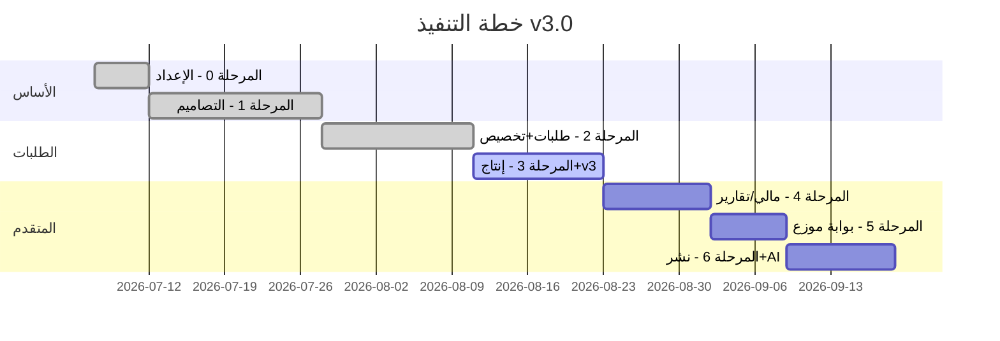

# خطة التنفيذ المرحلية — DecoZR ERP v3.0

> مبنية على [نموذج عمل الورشة](./DOMAIN-MODEL.md) — **تصميم ≠ منتج**

---

## ⚠️ حالة التنفيذ

> **✅ موافقة المستخدم — بدأ التطوير 6 يوليو 2026**  
> **🔄 تحديث 22 يوليو 2026 — مسار الطلب الكامل: سلة عامة → طلب → إنتاج → QR عامل**

### ما اكتمل

| المرحلة | الحالة | ملاحظات |
|---------|--------|---------|
| 0 البنية | ✅ | NestJS + Prisma + SQLite + Seed عربي نظيف |
| 1 التصاميم | ✅ أساسي | CRUD + إصدارات + BOM + خيارات + تسعير ذكي + library_status/حقوق |
| 2 الطلبات | ✅ | إنشاء ERP + طلب عام من السلة + QR عام + Workspace رسائل/حالة |
| 3 إنتاج/آلات | ✅ أساسي | start production + خصم BOM + مهام آلات + واجهة عامل QR |
| 3b Offcuts | ✅ | CRUD + available match |
| 3c Workflow | ✅ | قوالب مرنة + 9 مراحل افتراضية |
| 3d Seasons | ✅ API | CRUD + ربط تصاميم |
| 4 مالية | 🔶 جزئي | invoices/payments موجودة — تقارير ربح تحتاج صقل |
| 5 بوابة موزع | 🔶 واجهة | صفحات portal موجودة — بعضها ما زال يحتاج hardening |
| 6 AI/Backup | ⏳ | لاحقًا |

### حساب تجريبي
`admin@decozr.local` / `admin123`

---

## نظرة عامة — المراحل

| المرحلة | المدة   | الهدف                                       |
| ------- | ------- | ------------------------------------------- |
| 0       | 5 أيام  | البنية التحتية                              |
| 1       | 16 يوم  | **كتالوج التصاميم** + إصدارات + BOM + تخصيص |
| 2       | 14 يوم  | طلبات + محرك تخصيص + أرشيف إعادة تصنيع      |
| 3       | 12 يوم  | آلات + machine_jobs + QR + خصم مخزون        |
| 4       | 10 أيام | مدفوعات + تقارير + تكلفة/ربح                |
| 5       | 7 أيام  | **بوابة الموزع** `/portal`                  |
| 6       | 10 أيام | نشر + backup + **AI (اختياري)**             |

**المدة الإجمالية:** ~10-12 أسبوع

---

## المرحلة 0: الإعداد (5 أيام)

*(بدون تغيير جوهري عن v1)*

### معايير القبول

- [x] Docker Compose يعمل
- [x] Prisma schema v2 (designs, not products-first)
- [x] RTL frontend scaffold

---

## المرحلة 1: كتالوج التصاميم — النواة (16 يوم)

> **أهم مرحلة — هنا يُبنى ما يميز الورشة**

### Backend

| #    | Module                                  | التفاصيل                   |
| ---- | --------------------------------------- | -------------------------- |
| 1.1  | Auth + RBAC                             | كما v1 + صلاحيات designs.* |
| 1.2  | design_categories                       | شجرة فئات                  |
| 1.3  | designs + design_versions               | CRUD + versioning          |
| 1.4  | design_version_files                    | رفع AI, CDR, SVG, DXF, PDF |
| 1.5  | design_customization_options            | محرك الخيارات              |
| 1.6  | design_bom_materials + design_bom_labor | BOM حقيقي                  |
| 1.7  | design_price_rules                      | تسعير ديناميكي             |
| 1.8  | machines                                | CRUD آلات                  |
| 1.9  | POST /designs/calculate-price           | حساب سعر من خيارات         |
| 1.10 | POST /designs/calculate-bom             | حساب BOM من خيارات         |

### Frontend (مدير)

| #    | Page                            |
| ---- | ------------------------------- |
| 1.11 | كتالوج التصاميم (شجرة + بطاقات) |
| 1.12 | إنشاء/تعديل تصميم               |
| 1.13 | إدارة إصدارات (v1, v2, v3)      |
| 1.14 | محرر BOM (مواد + دقائق + آلات)  |
| 1.15 | محرر خيارات التخصيص             |
| 1.16 | قواعد التسعير لكل قائمة أسعار   |
| 1.17 | إدارة الآلات                    |

### معايير القبول

- [ ] إنشاء تصميم F125 مع إصدار v1
- [ ] رفع ملفات AI + DXF للإصدار
- [ ] تعريف خيارات: مقاس، لون، مادة، سماكة، LED
- [ ] BOM: 0.7م فوركس + 15د قص Laser + 30د تجميع
- [ ] تعديل التصميم → إصدار v2 (v1 محفوظ)
- [ ] حساب سعر: F125 + فوركس + 40سم + ذهبي = X د.ج
- [ ] حساب تكلفة وربح من BOM

---

## المرحلة 2: الطلبات ومحرك التخصيص (14 يوم)

### Backend

| #   | Module                                                      |
| --- | ----------------------------------------------------------- |
| 2.1 | orders + order_items (design_version_id + options_snapshot) |
| 2.2 | دورة حياة 9 حالات                                           |
| 2.3 | reorder_from_order_id — إعادة تصنيع                         |
| 2.4 | qr_code_token لكل طلب                                       |
| 2.5 | customers + files                                           |

### Frontend

| #   | Page                                   |
| --- | -------------------------------------- |
| 2.6 | إنشاء طلب — اختيار تصميم + محرك تخصيص  |
| 2.7 | تفاصيل طلب — لقطة الخيارات + BOM محسوب |
| 2.8 | زر «إعادة تصنيع» من طلب سابق           |
| 2.9 | طباعة فاتورة + QR                      |

### معايير القبول

- [ ] طلب كامل: تصميم + خيارات منظمة (ليس ملاحظات فقط)
- [ ] إعادة تصنيع طلب 2025 في 2026 بنفس الخيارات والملفات
- [ ] QR يُطبع مع الفاتورة
- [ ] options_snapshot ثابت حتى لو تغيّر التصميم

---

## المرحلة 3: الإنتاج والآلات وQR (12 يوم)

### Backend

| #   | Module                             |
| --- | ---------------------------------- |
| 3.1 | machine_jobs — جدولة من BOM        |
| 3.2 | GET /orders/by-qr/:token           |
| 3.3 | خصم مخزون من computed_bom_snapshot |
| 3.4 | Kanban + production tasks          |
| 3.5 | تقرير مواد ناقصة قبل الإنتاج       |

### Frontend

| #   | Page                                |
| --- | ----------------------------------- |
| 3.6 | `/w/:orderNumber` — واجهة QR للعامل |
| 3.7 | Kanban                              |
| 3.8 | جدولة الآلات                        |
| 3.9 | رفع صورة أثناء التنفيذ              |

### معايير القبول

- [ ] العامل يمسح QR → يرى ملفات + ملاحظات + كمية
- [ ] بدء/إنهاء مهمة Laser مع تسجيل الوقت
- [ ] خصم 0.7م فوركس × 3 قطع من المخزون
- [ ] تنبيه مواد ناقصة قبل القص

---

## المرحلة 4: المالية والتقارير (10 أيام)

### إضافات v2

| #   | Feature                                      |
| --- | -------------------------------------------- |
| 4.1 | تقرير **ربح حقيقي** (سعر − تكلفة BOM)        |
| 4.2 | تقرير تكلفة المواد لكل تصميم                 |
| 4.3 | Dashboard: أكثر التصاميم مبيعاً (ليس منتجات) |

*(باقي المدفوعات والإشعارات كما v1)*

---

## المرحلة 5: بوابة الموزع (7 أيام)

> **واجهة منفصلة تماماً — ليس ERP مبسط**

| #   | Task                                        |
| --- | ------------------------------------------- |
| 5.1 | Layout `/portal` — mobile-first, bottom nav |
| 5.2 | 6 صفحات فقط                                 |
| 5.3 | Route guard — الموزع لا يصل لـ `/dashboard` |
| 5.4 | كتالوج + تخصيص + طلب                        |
| 5.5 | إعادة تصنيع من طلباتي                       |

### معايير القبول

- [ ] الموزع يرى فقط `/portal/`*
- [ ] تجربة mobile سلسة
- [ ] لا تسريب لصفحات ERP

---

## المرحلة 6: النشر + AI (10 أيام)

| #   | Task                    | Priority   |
| --- | ----------------------- | ---------- |
| 6.1 | Production deploy + SSL | 🔴         |
| 6.2 | Backup + Audit          | 🔴         |
| 6.3 | POST /ai/analyze-image  | 🟡 اختياري |
| 6.4 | similar-designs search  | 🟢 مستقبلي |

---

## ما بعد الإطلاق

| #   | Feature                 |
| --- | ----------------------- |
| 1   | AI اقتراح تصاميم مشابهة |
| 2   | SMS / WhatsApp          |
| 3   | Cloud migration         |
| 4   | Multi-branch            |

---

## Checklist قبل البدء

- [ ] مراجعة [DOMAIN-MODEL.md](./DOMAIN-MODEL.md) ✅
- [ ] الموافقة على فصل التصميم/المنتج
- [ ] الموافقة على 7 مراحل
- [ ] **موافقة صريحة للبدء**

---

[← API](./API.md) | [نموذج العمل](./DOMAIN-MODEL.md)