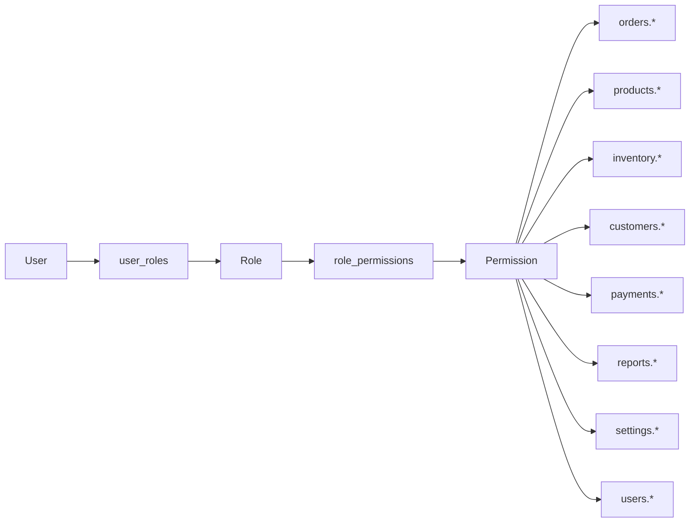
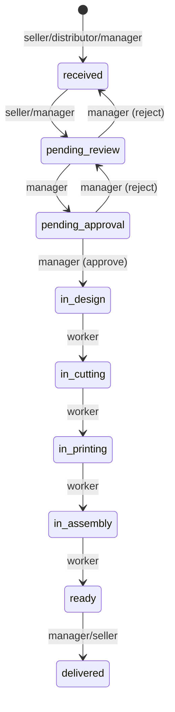

# نظام الصلاحيات (RBAC)

> جزء من [وثيقة التصميم المعماري](./ARCHITECTURE.md)

---

## 1. نموذج RBAC



**مبدأ:** Least Privilege — كل دور يحصل على الحد الأدنى من الصلاحيات اللازمة.

---

## 2. قائمة الصلاحيات الكاملة

### 2.1 وحدة الطلبات (`orders`)

| slug | الوصف |
|------|-------|
| `orders.create` | إنشاء طلب جديد |
| `orders.read.own` | قراءة طلباته فقط |
| `orders.read.all` | قراءة جميع الطلبات |
| `orders.update.own` | تعديل طلباته (قبل الموافقة) |
| `orders.update.all` | تعديل أي طلب |
| `orders.delete` | حذف/إلغاء طلب |
| `orders.change_status` | تغيير حالة الطلب |
| `orders.assign` | إسناد طلب لعامل |
| `orders.approve` | الموافقة على الطلب |
| `orders.upload_files` | رفع ملفات للطلب |
| `orders.export` | تصدير الطلبات |

### 2.2 وحدة التصاميم (`designs`)

| slug | الوصف |
|------|-------|
| `designs.read` | عرض كتالوج التصاميم |
| `designs.create` | إضافة تصميم |
| `designs.update` | تعديل تصميم |
| `designs.delete` | حذف/أرشفة تصميم |
| `designs.manage_versions` | إنشاء إصدارات جديدة |
| `designs.manage_bom` | إدارة BOM (مواد + عمل) |
| `designs.manage_options` | إدارة خيارات التخصيص |
| `designs.manage_prices` | قواعد التسعير الديناميكي |

### 2.3 وحدة الآلات (`machines`)

| slug | الوصف |
|------|-------|
| `machines.read` | عرض الآلات |
| `machines.manage` | إدارة الآلات |
| `machines.assign_jobs` | إسناد مهام تشغيل |
| `machines.scan_qr` | مسح QR وبدء/إنهاء مهمة |

### 2.4 وحدة المنتجات (`products`) — مُهمَل في v2

> استُبدلت بـ `designs.*`. تُبقى للتوافق إن وُجدت متغيرات مُولَّدة.

### 2.5 وحدة العملاء (`customers`)

| slug | الوصف |
|------|-------|
| `customers.read.own` | عملاؤه فقط |
| `customers.read.all` | جميع العملاء |
| `customers.create` | إضافة عميل |
| `customers.update` | تعديل عميل |
| `customers.delete` | حذف عميل |
| `customers.view_balance` | عرض الرصيد/الديون |

### 2.4 وحدة المخزون (`inventory`)

| slug | الوصف |
|------|-------|
| `inventory.read` | عرض المخزون |
| `inventory.adjust` | تعديل يدوي |
| `inventory.manage_materials` | إدارة المواد |
| `inventory.view_movements` | سجل الحركات |

### 2.5 وحدة المدفوعات (`payments`)

| slug | الوصف |
|------|-------|
| `payments.read` | عرض المدفوعات |
| `payments.create` | تسجيل دفعة |
| `payments.delete` | حذف دفعة |
| `payments.manage_debts` | إدارة الديون |

### 2.6 وحدة التقارير (`reports`)

| slug | الوصف |
|------|-------|
| `reports.dashboard` | لوحة التحكم |
| `reports.sales` | تقارير المبيعات |
| `reports.production` | تقارير الإنتاج |
| `reports.inventory` | تقارير المخزون |
| `reports.financial` | التقارير المالية |

### 2.7 وحدة الإعدادات (`settings`)

| slug | الوصف |
|------|-------|
| `settings.read` | عرض الإعدادات |
| `settings.update` | تعديل الإعدادات |
| `settings.backup` | إدارة النسخ الاحتياطي |

### 2.8 وحدة المستخدمين (`users`)

| slug | الوصف |
|------|-------|
| `users.read` | عرض المستخدمين |
| `users.create` | إنشاء مستخدم |
| `users.update` | تعديل مستخدم |
| `users.delete` | حذف/تعطيل |
| `users.manage_roles` | إدارة الأدوار |

### 2.9 وحدة التدقيق (`audit`)

| slug | الوصف |
|------|-------|
| `audit.read` | عرض سجل التدقيق |

---

## 3. مصفوفة الصلاحيات حسب الدور

### رموز: ✅ مسموح | ❌ ممنوع | 🔶 محدود (own = ملكيته فقط)

| الصلاحية | مدير | بائع | موزع | عامل |
|----------|:----:|:----:|:----:|:----:|
| **الطلبات** |
| orders.create | ✅ | ✅ | ✅ | ❌ |
| orders.read.all | ✅ | ❌ | ❌ | 🔶 |
| orders.read.own | ✅ | 🔶 | 🔶 | 🔶 |
| orders.update.all | ✅ | ❌ | ❌ | ❌ |
| orders.update.own | ✅ | 🔶 | 🔶 | ❌ |
| orders.delete | ✅ | ❌ | ❌ | ❌ |
| orders.change_status | ✅ | 🔶¹ | ❌ | 🔶² |
| orders.assign | ✅ | ❌ | ❌ | ❌ |
| orders.approve | ✅ | ❌ | ❌ | ❌ |
| orders.upload_files | ✅ | ✅ | ✅ | ✅ |
| orders.export | ✅ | 🔶 | 🔶 | ❌ |
| **التصاميم** |
| designs.read | ✅ | ✅ | ✅ | ✅ |
| designs.create | ✅ | ❌ | ❌ | ❌ |
| designs.update | ✅ | ❌ | ❌ | ❌ |
| designs.manage_versions | ✅ | ❌ | ❌ | ❌ |
| designs.manage_bom | ✅ | ❌ | ❌ | 🔶⁴ |
| designs.manage_prices | ✅ | ❌ | ❌ | ❌ |
| **الآلات** |
| machines.read | ✅ | ❌ | ❌ | ✅ |
| machines.assign_jobs | ✅ | ❌ | ❌ | 🔶⁵ |
| machines.scan_qr | ✅ | ❌ | ❌ | ✅ |
| **المنتجات (قديم)** |
| products.read | ✅ | ✅ | ✅ | ✅ |
| **العملاء** |
| customers.read.all | ✅ | 🔶³ | 🔶³ | ❌ |
| customers.create | ✅ | ✅ | ❌ | ❌ |
| customers.update | ✅ | 🔶 | ❌ | ❌ |
| customers.delete | ✅ | ❌ | ❌ | ❌ |
| customers.view_balance | ✅ | 🔶 | 🔶 | ❌ |
| **المخزون** |
| inventory.read | ✅ | ❌ | ❌ | ✅ |
| inventory.adjust | ✅ | ❌ | ❌ | ❌ |
| inventory.manage_materials | ✅ | ❌ | ❌ | ❌ |
| inventory.view_movements | ✅ | ❌ | ❌ | 🔶 |
| **المدفوعات** |
| payments.read | ✅ | 🔶 | 🔶 | ❌ |
| payments.create | ✅ | ✅ | ❌ | ❌ |
| payments.delete | ✅ | ❌ | ❌ | ❌ |
| payments.manage_debts | ✅ | ❌ | ❌ | ❌ |
| **التقارير** |
| reports.dashboard | ✅ | ✅ | ✅ | ✅ |
| reports.sales | ✅ | 🔶 | 🔶 | ❌ |
| reports.production | ✅ | ❌ | ❌ | 🔶 |
| reports.inventory | ✅ | ❌ | ❌ | ❌ |
| reports.financial | ✅ | ❌ | ❌ | ❌ |
| **الإعدادات** |
| settings.* | ✅ | ❌ | ❌ | ❌ |
| **المستخدمين** |
| users.* | ✅ | ❌ | ❌ | ❌ |
| **التدقيق** |
| audit.read | ✅ | ❌ | ❌ | ❌ |

**ملاحظات:**
1. 🔶¹ البائع: تغيير الحالة فقط `received → pending_review`
2. 🔶² العامل: تغيير حالات الإنتاج فقط (`in_design` → `delivered`)
3. 🔶³ البائع/الموزع: عملاؤه المرتبطون بطلباته فقط
4. 🔶⁴ العامل: قراءة BOM فقط للطلبات المسندة
5. 🔶⁵ العامل: إسناد ذاتي عند مسح QR

---

## 4. قواعد الوصول التفصيلية

### 4.1 المدير (Manager)

```
✅ CAN:
  - كل العمليات بدون قيد
  - إدارة المستخدمين والأدوار
  - الموافقة على الطلبات
  - إسناد الطلبات للعمال
  - تعديل الأسعار وقوائم الأسعار
  - تقارير مالية كاملة
  - إعدادات النظام والنسخ الاحتياطي
  - سجل التدقيق

❌ CANNOT:
  - (لا قيود — صلاحيات كاملة)
```

### 4.2 البائع (Seller)

```
✅ CAN:
  - إنشاء طلبات تجزئة (price_list = retail)
  - عرض طلباته وعملائه
  - تعديل طلب قبل الموافقة
  - تسجيل مدفوعات لطلباته
  - رفع ملفات التصميم
  - عرض كatalog المنتجات (أسعار retail/wholesale)
  - لوحة تحكم مبيعاته

❌ CANNOT:
  - رؤية طلبات بائعين آخرين
  - تغيير حالات الإنتاج
  - الموافقة على الطلبات
  - إدارة المخزون
  - تعديل الأسعار
  - حذف طلبات مؤكدة
  - التقارير المالية
  - إعدادات النظام
```

### 4.3 الموزع (Distributor) — بوابة منفصلة `/portal`

```
✅ CAN (6 صفحات فقط — لا يرى ERP):
  - الكتالوج (تصاميم + خيارات تخصيص)
  - طلب جديد (محرك تخصيص)
  - طلباتي + تتبع
  - إعادة تصنيع من طلب سابق
  - ديوني + فواتير
  - التنبيهات

❌ CANNOT:
  - أي صفحة ERP (/dashboard, /inventory, /settings...)
  - رؤية طلبات أو عملاء آخرين
  - تغيير أي حالة
  - تسجيل مدفوعات
  - إدارة تصاميم أو مخزون أو آلات
```

### 4.5 العامل (Worker) — واجهة QR `/w/:order`

```
✅ CAN:
  - مسح QR → عرض ملفات + ملاحظات + كمية + مرحلة
  - بدء/إنهاء مهمة آلة (machine_jobs)
  - تغيير حالة الإنتاج
  - رفع صورة أثناء التنفيذ
  - عرض BOM المحسوب للطلب

❌ CANNOT:
  - الوصول لـ ERP الكامل (إلا إن مُنح صلاحية)
  - إنشاء أو تعديل طلبات/أسعار
```

### 4.6 العامل (Worker) — ERP

```
✅ CAN:
  - عرض الطلبات المسندة إليه + الطلبات في مراحل الإنتاج
  - تغيير حالة الإنتاج:
      in_design → in_cutting → in_printing → in_assembly → ready
  - رفع/تحميل ملفات الإنتاج
  - عرض BOM والمواد المطلوبة
  - عرض المخزون (قراءة)
  - لوحة مهام الإنتاج

❌ CANNOT:
  - إنشاء طلبات
  - تعديل أسعار أو بنود
  - تغيير إلى: received, pending_review, pending_approval, delivered
  - إدارة عملاء أو مدفوعات
  - أي تقارير مالية
  - إعدادات
```

---

## 5. قيود انتقال الحالات (State Machine Guards)



| الانتقال | الأدوار المسموحة |
|----------|------------------|
| → received | manager, seller, distributor |
| received → pending_review | manager, seller |
| pending_review → pending_approval | manager |
| pending_review → received | manager |
| pending_approval → in_design | manager |
| pending_approval → pending_review | manager |
| in_design → in_cutting | worker, manager |
| in_cutting → in_printing | worker, manager |
| in_printing → in_assembly | worker, manager |
| in_assembly → ready | worker, manager |
| ready → delivered | manager, seller |

---

## 6. تطبيق RBAC في Backend

```typescript
// NestJS Guard Pattern — تصميم فقط
@UseGuards(JwtAuthGuard, RolesGuard)
@Permissions('orders.change_status')
@OrderStatusTransition(['in_design', 'in_cutting'])
@Roles('worker', 'manager')
async updateOrderStatus() { ... }
```

**طبقات الحماية:**
1. **JWT Guard** — مصادقة
2. **Roles Guard** — التحقق من الدور
3. **Permissions Guard** — التحقق من الصلاحية
4. **Ownership Guard** — `.own` permissions
5. **State Machine Guard** — انتقالات الحالة

---

## 7. Row-Level Security (اختياري — PostgreSQL RLS)

```sql
-- مثال: البائع يرى طلباته فقط
CREATE POLICY seller_orders ON orders
  FOR SELECT
  USING (
    created_by = current_setting('app.user_id')::uuid
    OR current_setting('app.role') = 'manager'
  );
```

---

[← قاعدة البيانات](./DATABASE.md) | [الصفحات و UI →](./UI-PAGES.md)
