# الصفحات، التنقل، وتصميم UI/UX

> جزء من [وثيقة التصميم المعماري](./ARCHITECTURE.md)

---

## 1. خريطة الموقع الكاملة (Sitemap)

```mermaid
graph TD
    ROOT[🏠 الرئيسية] --> AUTH[🔐 المصادقة]
    ROOT --> APP[📱 التطبيق]

    AUTH --> LOGIN[تسجيل الدخول]
    AUTH --> FORGOT[نسيت كلمة المرور]

    APP --> DASH[لوحة التحكم]
    APP --> ORDERS[الطلبات]
    APP --> DESIGNS[كتالوج التصاميم]
    APP --> PORTAL[بوابة الموزع /portal]
    APP --> WORKER_QR[واجهة QR /w]
    APP --> CUSTOMERS[العملاء]
    APP --> INVENTORY[المخزون]
    APP --> PAYMENTS[المدفوعات]
    APP --> REPORTS[التقارير]
    APP --> SETTINGS[الإعدادات]
    APP --> PROFILE[الملف الشخصي]
    APP --> NOTIF[الإشعارات]

    ORDERS --> OL[قائمة الطلبات]
    ORDERS --> OC[إنشاء طلب]
    ORDERS --> OD[تفاصيل الطلب]
    ORDERS --> OK[Kanban الإنتاج]

    DESIGNS --> DL[قائمة التصاميم]
    DESIGNS --> DC[إضافة تصميم]
    DESIGNS --> DE[تعديل + إصدارات]
    DESIGNS --> DBOM[محرر BOM]
    DESIGNS --> DOPT[خيارات التخصيص]
    DESIGNS --> DCAT[فئات التصاميم]
    DESIGNS --> DPRICE[قواعد التسعير]

    APP --> MACHINES[الآلات]
    MACHINES --> ML[قائمة الآلات]
    MACHINES --> MJ[جدولة المهام]

    CUSTOMERS --> CL[قائمة العملاء]
    CUSTOMERS --> CC[إضافة عميل]
    CUSTOMERS --> CD[تفاصيل العميل]

    INVENTORY --> IL[المواد]
    INVENTORY --> IM[حركات المخزون]
    INVENTORY --> IA[تعديل مخزون]

    PAYMENTS --> PYL[المدفوعات]
    PAYMENTS --> DEBT[الديون]
    PAYMENTS --> PYC[تسجيل دفعة]

    REPORTS --> RS[المبيعات]
    REPORTS --> RP[الإنتاج]
    REPORTS --> RI[المخزون]
    REPORTS --> RF[المالية]

    SETTINGS --> SU[المستخدمون]
    SETTINGS --> SR[الأدوار]
    SETTINGS --> SS[إعدادات عامة]
    SETTINGS --> SB[النسخ الاحتياطي]
    SETTINGS --> SA[سجل التدقيق]
```



---

## 2. الصفحات حسب الدور

### 2.1 المدير (Manager) — 28 صفحة

| # | المسار | الصفحة | الوصف |
|---|--------|--------|-------|
| 1 | `/dashboard` | لوحة التحكم | KPIs، رسوم، طلبات عاجلة |
| 2 | `/orders` | قائمة الطلبات | كل الطلبات + فلاتر + بحث |
| 3 | `/orders/new` | طلب جديد | إنشاء طلب |
| 4 | `/orders/:id` | تفاصيل الطلب | lifecycle، ملفات، مدفوعات |
| 5 | `/orders/kanban` | لوحة Kanban | عرض مرئي للإنتاج |
| 6 | `/designs` | كتالوج التصاميم | شجرة فئات + بطاقات |
| 7 | `/designs/new` | تصميم جديد | |
| 8 | `/designs/:id` | تفاصيل التصميم | إصدارات، ملفات، BOM |
| 9 | `/designs/:id/versions/new` | إصدار جديد | Versioning |
| 10 | `/designs/:id/bom` | محرر BOM | مواد + عمل + آلات |
| 11 | `/designs/:id/options` | خيارات التخصيص | محرك التخصيص |
| 12 | `/design-categories` | فئات التصاميم | |
| 13 | `/machines` | الآلات | Laser, CNC, UV... |
| 14 | `/machines/schedule` | جدولة المهام | |
| 15 | `/price-lists` | قواعد التسعير | |
| 16 | `/customers` | العملاء | |
| 12 | `/customers/new` | عميل جديد | |
| 13 | `/customers/:id` | تفاصيل العميل | طلبات، ديون |
| 14 | `/inventory` | المخزون | |
| 15 | `/inventory/materials/new` | مادة جديدة | |
| 16 | `/inventory/movements` | حركات المخزون | |
| 17 | `/payments` | المدفوعات | |
| 18 | `/payments/new` | تسجيل دفعة | |
| 19 | `/debts` | الديون | |
| 20 | `/reports/sales` | تقرير المبيعات | |
| 21 | `/reports/production` | تقرير الإنتاج | |
| 22 | `/reports/inventory` | تقرير المخزون | |
| 23 | `/reports/financial` | التقرير المالي | |
| 24 | `/settings/users` | المستخدمون | |
| 25 | `/settings/roles` | الأدوار والصلاحيات | |
| 26 | `/settings/general` | إعدادات عامة | |
| 27 | `/settings/backup` | النسخ الاحتياطي | |
| 28 | `/settings/audit-log` | سجل التدقيق | |

### 2.2 البائع (Seller) — 12 صفحة

| # | المسار | الصفحة |
|---|--------|--------|
| 1 | `/dashboard` | لوحة البائع |
| 2 | `/orders` | طلباتي |
| 3 | `/orders/new` | طلب جديد |
| 4 | `/orders/:id` | تفاصيل الطلب |
| 5 | `/products` | كatalog (قراءة) |
| 6 | `/customers` | عملائي |
| 7 | `/customers/new` | عميل جديد |
| 8 | `/customers/:id` | تفاصيل العميل |
| 9 | `/payments` | مدفوعاتي |
| 10 | `/payments/new` | تسجيل دفعة |
| 11 | `/reports/sales` | مبيعاتي |
| 12 | `/profile` | الملف الشخصي |

### 2.3 الموزع (Distributor) — بوابة `/portal` — 6 صفحات فقط

| # | المسار | الصفحة |
|---|--------|--------|
| 1 | `/portal` | الرئيسية — bottom nav |
| 2 | `/portal/catalog` | كتالوج التصاميم |
| 3 | `/portal/catalog/:code` | تفاصيل + تخصيص |
| 4 | `/portal/orders/new` | طلب جديد |
| 5 | `/portal/orders` | طلباتي + إعادة تصنيع |
| 6 | `/portal/debts` | ديوني + فواتير |
| 7 | `/portal/notifications` | التنبيهات |

> **لا يصل لأي مسار خارج `/portal/*`**

### 2.4 العامل (Worker) — 8 صفحات

| # | المسار | الصفحة |
|---|--------|--------|
| 1 | `/w/:orderNumber` | **واجهة QR** — mobile-first |
| 2 | `/dashboard` | لوحة الإنتاج |
| 3 | `/orders/kanban` | Kanban |
| 4 | `/orders/:id` | تفاصيل + ملفات |
| 5 | `/tasks` | مهامي (machine_jobs) |
| 6 | `/inventory` | المخزون (قراءة) |
| 7 | `/notifications` | الإشعارات |
| 8 | `/profile` | الملف الشخصي |

### 2.5 العامل — واجهة QR `/w/:orderNumber`

---

## 3. هيكل التنقل (Navigation)

### 3.1 الشريط الجانبي — المدير

```
┌─────────────────────────────┐
│  🏭 ورشتنا ERP              │
│  ─────────────────────────  │
│  📊 لوحة التحكم             │
│  📋 الطلبات            (12) │
│     ├─ قائمة الطلبات        │
│     ├─ طلب جديد             │
│     └─ Kanban الإنتاج       │
│  📦 المنتجات                │
│     ├─ الكatalog            │
│     ├─ التصنيفات            │
│     └─ قوائم الأسعار        │
│  👥 العملاء                 │
│  🏗️ المخزون                 │
│  💰 المدفوعات والديون       │
│  📈 التقارير                │
│  ⚙️ الإعدادات               │
│  ─────────────────────────  │
│  🔔 الإشعارات          (3)  │
│  👤 أحمد المدير             │
└─────────────────────────────┘
```

### 3.2 الشريط العلوي (Top Bar)

```
┌──────────────────────────────────────────────────────────────┐
│  🔍 [بحث: رقم طلب، عميل، هاتف، منتج...]    🔔(3)  🌙  👤 ▼  │
└──────────────────────────────────────────────────────────────┘
```

---

## 4. مبادئ UI/UX

### 4.1 المبادئ الأساسية

| المبدأ | التطبيق |
|--------|---------|
| **RTL أولاً** | `dir="rtl"`, Tailwind RTL plugin, خط عربي (IBM Plex Sans Arabic / Cairo) |
| **Responsive** | Mobile-first: sidebar → drawer على الشاشات الصغيرة |
| **Professional** | ألوان هادئة، whitespace كافٍ، typography واضح |
| **Accessible** | WCAG 2.1 AA, keyboard navigation, ARIA labels |
| **Performance** | Lazy loading, virtualized tables, optimistic updates |
| **Consistency** | Design system موحد (shadcn/ui) |

### 4.2 نظام الألوان

```
Primary:    #1E40AF (أزرق — الثقة، الاحتراف)
Secondary:  #059669 (أخضر — نجاح، جاهز)
Warning:    #D97706 (برتقالي — انتظار، تنبيه)
Danger:     #DC2626 (أحمر — متأخر، خطأ، دين)
Neutral:    #64748B (رمادي — نص ثانوي)
Background: #F8FAFC (فاتح) / #0F172A (داكن)
```

### 4.3 ألوان حالات الطلب

| الحالة | اللون | Badge |
|--------|-------|-------|
| تم استلام الطلب | `#6366F1` | 🟣 |
| بانتظار المراجعة | `#F59E0B` | 🟡 |
| بانتظار الموافقة | `#F97316` | 🟠 |
| قيد التصميم | `#3B82F6` | 🔵 |
| قيد القص | `#8B5CF6` | 🟣 |
| قيد الطباعة | `#06B6D4` | 🔷 |
| قيد التجميع | `#14B8A6` | 🩵 |
| جاهز | `#22C55E` | 🟢 |
| تم التسليم | `#64748B` | ⚫ |

### 4.4 Typography

```
Font Family: 'IBM Plex Sans Arabic', 'Cairo', sans-serif
Heading 1:   2rem / 700
Heading 2:   1.5rem / 600
Body:        1rem / 400
Small:       0.875rem / 400
Numbers:     tabular-nums (للأسعار والكميات)
```

---

## 5. وصف Wireframes للشاشات الرئيسية

### 5.1 لوحة التحكم — المدير

```
┌─────────────────────────────────────────────────────────────────┐
│  لوحة التحكم                                    [اليوم ▼] [📅]  │
├──────────────┬──────────────┬──────────────┬─────────────────────┤
│  📋 47       │  ⏳ 12       │  ✅ 8        │  💰 245,000 د.ج    │
│  طلبات نشطة  │  بانتظار     │  جاهزة       │  إيرادات الشهر     │
│              │  الموافقة    │  للتسليم     │                     │
├──────────────┴──────────────┴──────────────┴─────────────────────┤
│  ┌─────────────────────────┐  ┌─────────────────────────────┐   │
│  │  📈 مبيعات آخر 30 يوم   │  │  🏭 الطلبات حسب المرحلة    │   │
│  │  [Line Chart]           │  │  [Bar Chart — 9 statuses]   │   │
│  └─────────────────────────┘  └─────────────────────────────┘   │
├──────────────────────────────────────────────────────────────────┤
│  ⚠️ تنبيهات                                                     │
│  • 3 طلبات متأخرة  • 2 مواد مخزون منخفض  • 5 ديون مستحقة       │
├──────────────────────────────────────────────────────────────────┤
│  📋 آخر الطلبات                                                 │
│  ┌────────┬──────────┬─────────┬──────────┬────────┬─────────┐  │
│  │ الرقم  │ العميل   │ المبلغ  │ الحالة   │ التاريخ│ إجراء   │  │
│  ├────────┼──────────┼─────────┼──────────┼────────┼─────────┤  │
│  │ORD-142 │ محمد     │ 15,000  │🟡 مراجعة │ اليوم  │ [عرض]   │  │
│  │ORD-141 │ شركة X   │ 85,000  │🔵 تصميم  │ أمس    │ [عرض]   │  │
│  └────────┴──────────┴─────────┴──────────┴────────┴─────────┘  │
└──────────────────────────────────────────────────────────────────┘
```

**مكونات Dashboard:**
- `StatCard` — بطاقة KPI
- `SalesChart` — رسم مبيعات
- `StatusDistribution` — توزيع الحالات
- `AlertsList` — تنبيهات
- `RecentOrdersTable` — جدول مختصر
- `LowStockWidget` — مواد منخفضة
- `OverdueDebtsWidget` — ديون متأخرة

### 5.2 قائمة الطلبات

```
┌─────────────────────────────────────────────────────────────────┐
│  الطلبات                                    [+ طلب جديد]        │
├─────────────────────────────────────────────────────────────────┤
│  🔍 [بحث...]  [الحالة ▼] [التاريخ ▼] [البائع ▼] [🔄]         │
├─────────────────────────────────────────────────────────────────┤
│  ☐ │ الرقم      │ العميل    │ الهاتف     │ المبلغ  │ الحالة    │
│  ──┼────────────┼───────────┼────────────┼─────────┼───────────│
│  ☐ │ ORD-2026-142│ محمد أ.  │ 0555..   │ 15,000  │ 🟡 مراجعة │
│  ☐ │ ORD-2026-141│ شركة X   │ 0666..   │ 85,000  │ 🔵 تصميم  │
│  ...                                                            │
├─────────────────────────────────────────────────────────────────┤
│  ← 1 2 3 ... 10 →                    عرض 20 ▼  │ 487 طلب    │
└─────────────────────────────────────────────────────────────────┘
```

### 5.3 تفاصيل الطلب

```
┌─────────────────────────────────────────────────────────────────┐
│  ← العودة    ORD-2026-142                    [🖨️] [✏️] [⋮]   │
├─────────────────────────────────────────────────────────────────┤
│  ●━━━━●━━━━●━━━━○━━━━○━━━━○━━━━○━━━━○  Lifecycle Stepper      │
│  استلام  مراجعة  موافقة  تصميم  قص  طباعة  تجميع  جاهز  تسليم  │
├───────────────────────────────┬─────────────────────────────────┤
│  📋 البنود                    │  👤 العميل: محمد أحمد          │
│  ┌──────┬────┬─────┬────────┐ │  📞 0555 123 456               │
│  │منتج  │كمية│سعر  │المجموع │ │  📍 وهران                     │
│  ├──────┼────┼─────┼────────┤ │  ─────────────────              │
│  │لوحة  │ 2  │5000 │ 10,000 │ │  💰 المجموع: 15,000 د.ج       │
│  │فوركس │    │     │        │ │  ✅ مدفوع: 5,000               │
│  └──────┴────┴─────┴────────┘ │  ⏳ متبقي: 10,000               │
│                               │  ─────────────────              │
│  📎 الملفات (3)               │  📅 موعد التسليم: 10/07       │
│  [📄 design.ai] [📄 proof.pdf]│  👷 مسند إلى: karim.worker     │
│  [+ رفع ملف]                  │  ─────────────────              │
│                               │  [تغيير الحالة ▼] [💬 ملاحظة] │
├───────────────────────────────┴─────────────────────────────────┤
│  📜 سجل الحالات                                                 │
│  04/07 14:30 — أحمد → بانتظار المراجعة                         │
│  04/07 10:00 — أحمد → تم استلام الطلب                          │
└─────────────────────────────────────────────────────────────────┘
```

### 5.4 Kanban الإنتاج (للعامل)

```
┌─────────────────────────────────────────────────────────────────┐
│  🏭 لوحة الإنتاج                              [🔍] [👤 مهامي]  │
├──────────┬──────────┬──────────┬──────────┬──────────────────────┤
│ قيد      │ قيد      │ قيد      │ قيد      │ جاهز                 │
│ التصميم  │ القص     │ الطباعة  │ التجميع  │                      │
│ (4)      │ (2)      │ (3)      │ (1)      │ (5)                  │
├──────────┼──────────┼──────────┼──────────┼──────────────────────┤
│┌────────┐│┌────────┐│┌────────┐│┌────────┐│┌────────┐           │
││ORD-140 │││ORD-138 │││ORD-135 │││ORD-132 │││ORD-130 │           │
││🔴 عاجل │││لوحات   │││طباعة   │││تجميع   │││✅ جاهز │           │
││لوحة    │││حديد    │││UV      │││فوركس   │││        │           │
││فوركس   │││        │││        │││        │││        │           │
││📎 2 ملف│││📎 1 ملف│││📎 3 ملف│││        │││        │           │
│└────────┘│└────────┘│└────────┘│└────────┘│└────────┘           │
│  ...     │          │  ...     │          │  ...                 │
└──────────┴──────────┴──────────┴──────────┴──────────────────────┘
```

**تفاعل:** Drag & drop لتغيير الحالة (مع تأكيد + RBAC check)

### 5.5 إنشاء طلب جديد

```
┌─────────────────────────────────────────────────────────────────┐
│  ← العودة    طلب جديد                                           │
├─────────────────────────────────────────────────────────────────┤
│  ┌─ 1. العميل ──────────────────────────────────────────────┐   │
│  │  🔍 [بحث عميل بالاسم أو الهاتف...]  أو [+ عميل جديد]    │   │
│  │  ✅ محمد أحمد — 0555 123 456 — قائمة: تجزئة             │   │
│  └──────────────────────────────────────────────────────────┘   │
│  ┌─ 2. المنتجات ────────────────────────────────────────────┐   │
│  │  🔍 [بحث منتج...]                                        │   │
│  │  ┌────────┬──────┬────────┬────────┬────────┬─────────┐  │   │
│  │  │ المنتج │ الكمية│ السعر  │ خصم %  │ المجموع│         │  │   │
│  │  ├────────┼──────┼────────┼────────┼────────┼─────────┤  │   │
│  │  │[▼]     │ [1]  │ 5,000  │ [0]    │ 5,000  │ [🗑️]   │  │   │
│  │  └────────┴──────┴────────┴────────┴────────┴─────────┘  │   │
│  │  [+ إضافة منتج]                                          │   │
│  └──────────────────────────────────────────────────────────┘   │
│  ┌─ 3. التفاصيل ────────────────────────────────────────────┐   │
│  │  موعد التسليم: [📅]  الأولوية: [عادي ▼]                  │   │
│  │  ملاحظات: [________________________]                     │   │
│  │  📎 ملفات: [اسحب الملفات هنا — AI, PDF, CDR...]         │   │
│  └──────────────────────────────────────────────────────────┘   │
│  ┌─ الملخص ─────────────────────────────────────────────────┐   │
│  │  المجموع: 5,000 │ خصم: 0 │ الإجمالي: 5,000 د.ج          │   │
│  │                              [💾 حفظ مسودة] [✅ إرسال]   │   │
│  └──────────────────────────────────────────────────────────┘   │
└─────────────────────────────────────────────────────────────────┘
```

### 5.7 محرك التخصيص — إنشاء طلب

```
┌─────────────────────────────────────────────────────────────────┐
│  فانوس F125 — إصدار v3                    [صور التصميم ◀ ▶]    │
├─────────────────────────────────────────────────────────────────┤
│  ☑ المقاس        ( ) 30  (●) 40  ( ) 50  ( ) 60 سم              │
│  ☑ اللون         ( ) أبيض  ( ) أسود  (●) ذهبي                  │
│  ☑ المادة        (●) فوركس  ( ) MDF  ( ) حديد  ( ) ألمنيوم     │
│  ☑ السماكة       ( ) 3  (●) 5  ( ) 8  ( ) 10 مم                 │
│  ☑ الاسم المطبوع [محمد________________]                         │
│  ☑ LED           [✓] نعم                                        │
├─────────────────────────────────────────────────────────────────┤
│  الكمية: [3]    السعر للوحدة: 8,500 د.ج    المجموع: 25,500     │
│  📎 ملفات إضافية: [اسحب هنا]                                   │
│                              [🔄 إعادة تصنيع من طلب 2025]       │
│                              [✅ إضافة للطلب]                   │
└─────────────────────────────────────────────────────────────────┘
```

### 5.8 بوابة الموزع — Mobile

```
┌─────────────────────┐
│  🏭 ورشتنا          │
│  مرحباً، أحمد       │
├─────────────────────┤
│  [كتالوج التصاميم]  │
│  ┌────┐ ┌────┐      │
│  │F125│ │R010│ ...  │
│  └────┘ └────┘      │
├─────────────────────┤
│ 📚  ➕  📋  💳  🔔  │
│كتالوج جديد طلبات ديون│
└─────────────────────┘
```

### 5.9 كatalog التصاميم (المدير)

```
┌─────────────────────────────────────────────────────────────────┐
│  المنتجات                    [+ منتج] [📥 استيراد] [📤 تصدير]  │
├─────────────────────────────────────────────────────────────────┤
│  🔍 [بحث...]  [التصنيف ▼] [النوع ▼] [قائمة الأسعار: تجزئة ▼]  │
├─────────────────────────────────────────────────────────────────┤
│  ┌─────────────┐  ┌─────────────┐  ┌─────────────┐               │
│  │ [صورة]      │  │ [صورة]      │  │ [صورة]      │               │
│  │ PRD-001     │  │ PRD-002     │  │ PRD-003     │               │
│  │ لوحة فوركس  │  │ حامل حديد   │  │ طباعة UV    │               │
│  │ 3mm أبيض    │  │ 50×100      │  │ A3 ملون     │               │
│  │ 💰 5,000    │  │ 💰 12,000   │  │ 💰 800      │               │
│  │ [عرض][✏️]   │  │ [عرض][✏️]   │  │ [عرض][✏️]   │               │
│  └─────────────┘  └─────────────┘  └─────────────┘               │
└─────────────────────────────────────────────────────────────────┘
```

---

## 6. مكونات UI مشتركة (Component Library)

| المكون | الاستخدام |
|--------|-----------|
| `DataTable` | جداول مع sort, filter, pagination |
| `StatusBadge` | badge ملون لحالة الطلب |
| `OrderStepper` | lifecycle visual |
| `FileUploader` | drag-drop multi-file |
| `SearchCombobox` | بحث عميل/منتج |
| `PriceDisplay` | تنسيق عملة DZD |
| `ConfirmDialog` | تأكيد عمليات حساسة |
| `NotificationBell` | جرس + dropdown |
| `StatCard` | KPI cards |
| `DateRangePicker` | فلتر تاريخ |
| `EmptyState` | حالة فارغة |
| `LoadingSkeleton` | تحميل |
| `ErrorBoundary` | أخطاء |
| `SidebarNav` | تنقل RTL |
| `MobileDrawer` | sidebar على mobile |

---

## 7. Responsive Breakpoints

| Breakpoint | العرض | السلوك |
|------------|-------|--------|
| `sm` | ≥640px | Stack → grid |
| `md` | ≥768px | Sidebar collapsible |
| `lg` | ≥1024px | Sidebar ثابت |
| `xl` | ≥1280px | Layout كامل |
| `2xl` | ≥1536px | Kanban 5 columns |

---

## 8. Dark Mode

- Toggle في Top Bar
- CSS variables للألوان
- `prefers-color-scheme` كافتراضي
- حفظ التفضيل في localStorage

---

[← الصلاحيات](./RBAC.md) | [API →](./API.md)
