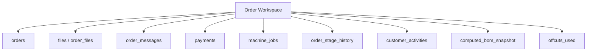

# مساحة عمل الطلب — Order Workspace

> **DecoZR ERP** — الميزة الثورية  
> جزء من [نموذج عمل الورشة](./DOMAIN-MODEL.md) v3.0

---

## الفكرة

كل طلب ليس «سطرًا في جدول» — بل **مشروع صغير** بمساحة عمل خاصة.

بدل التنقل بين: الطلبات، الملفات، المدفوعات، الملاحظات، WhatsApp، الدفتر...

```
┌─────────────────────────────────────────────────────────────────┐
│  ORD-2026-0142 — فانوس F125 × 3              [قيد القص]  🔴 عاجل │
├──────────┬──────────────────────────────────────────────────────┤
│          │  📋 نظرة عامة  │  📎 ملفات  │  💬 محادثة  │  ⏱️ وقت  │
│  العميل  │  💰 مالية  │  📷 صور  │  📜 سجل  │  🏭 إنتاج         │
├──────────┼──────────────────────────────────────────────────────┤
│ محمد أ.  │                                                      │
│ 0555...  │  [محتوى التبويب النشط]                               │
│ ديون: 0  │                                                      │
│          │                                                      │
│ [Timeline]│                                                     │
│ 15/03 طلب│                                                      │
│ 18/03 دفع│                                                      │
│ 22/03 تسليم                                                     │
└──────────┴──────────────────────────────────────────────────────┘
```

**كل ما يخص الطلب في مكان واحد.**

---

## مكونات المساحة

| التبويب | المحتوى | من يضيف |
|---------|---------|---------|
| **نظرة عامة** | الحالة، الخيارات، BOM، موعد التسليم، QR | النظام |
| **ملفات** | AI, CDR, DXF, PDF, SVG — مصدر + إنتاج + تسليم | الكل |
| **محادثة** | ملاحظات داخلية (بائع، عامل، مدير) — **ليست WhatsApp** | الكل |
| **وقت** | machine_jobs، مدة كل مرحلة، إجمالي ساعات | العامل/النظام |
| **مالية** | إجمالي، مدفوع، متبقي، دفعات، فواتير | بائع/مدير |
| **صور** | صور أثناء التنفيذ، قبل/بعد | العامل |
| **سجل** | تغييرات الحالة، تعديلات، audit | النظام |
| **إنتاج** | مراحل workflow، آلات، قصاصات مستخدمة | العامل/مدير |

---

## المحادثة الداخلية

```
┌─────────────────────────────────────────────────────────┐
│  💬 محادثة الطلب                                        │
├─────────────────────────────────────────────────────────┤
│  [أحمد — بائع] 15/03 10:00                              │
│  العميل يريد الاسم بالخط الكوفي                         │
│                                                         │
│  [كريم — عامل] 20/03 14:30                              │
│  اللون الذهبي نفد — هل نستخدم بديل؟                     │
│                                                         │
│  [المدير] 20/03 14:45                                   │
│  وافق العميل على البديل — تابع                        │
│                                                         │
│  [رفع ملف] [📷 صورة] [________________] [إرسال]        │
└─────────────────────────────────────────────────────────┘
```

- كل رسالة مرتبطة بـ `order_id` + `user_id` + `role`
- إشعار للمشاركين عند رسالة جديدة
- لا تختلط مع محادثات طلبات أخرى

---

## Timeline الموحّد

يجمع في مساحة الطلب **وسجل العميل**:

| الحدث | المصدر |
|-------|--------|
| إنشاء طلب | `orders.created_at` |
| دفع عربون | `payments` |
| اتصال/استفسار | `customer_activities` (يدوي) |
| تغيير حالة | `order_stage_history` |
| شكوى | `customer_activities` |
| استبدال | طلب مرتبط `reorder_from_order_id` |
| رسالة داخلية | `order_messages` |

---

## الربط مع بقية النظام



**مبدأ:** لا تكرار بيانات — Workspace **واجهة موحّدة** فوق جداول موجودة + `order_messages`.

---

## المسارات

| المستخدم | المسار |
|----------|--------|
| مدير/بائع | `/orders/:id/workspace` |
| عامل | `/w/:orderNumber` (نسخة مبسطة) |
| موزع | `/portal/orders/:id` (قراءة محدودة) |

---

## API

| Method | Endpoint | الوصف |
|--------|----------|-------|
| GET | `/orders/:id/workspace` | كل التبويبات في استجابة واحدة |
| GET | `/orders/:id/messages` | المحادثة |
| POST | `/orders/:id/messages` | رسالة + مرفق اختياري |
| GET | `/orders/:id/timeline` | خط زمني موحّد |
| GET | `/orders/:id/time-log` | سجل الوقت |

---

[← نموذج العمل](./DOMAIN-MODEL.md) | [قاعدة البيانات](./DATABASE.md)
